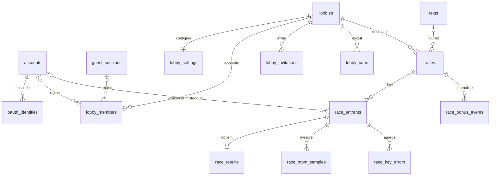
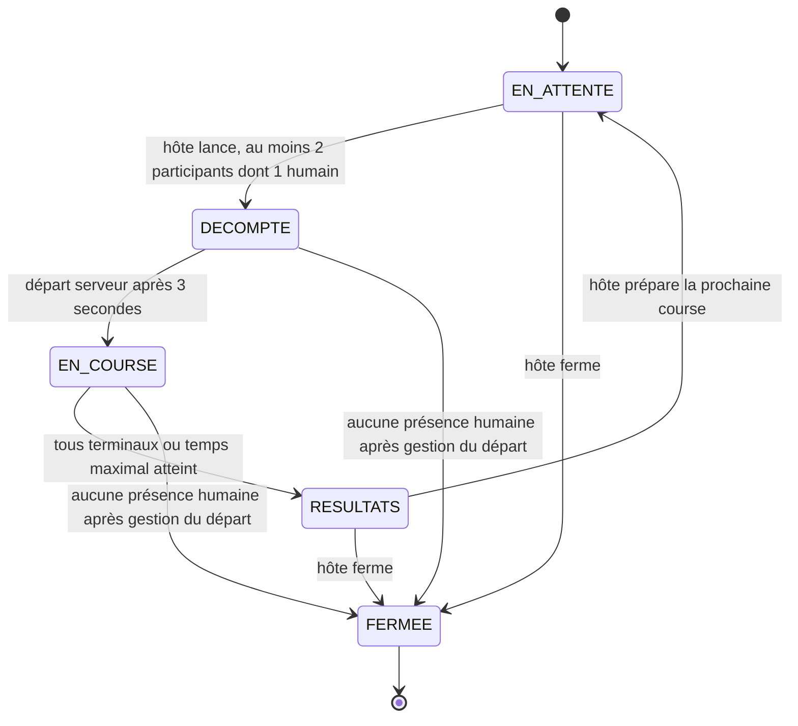
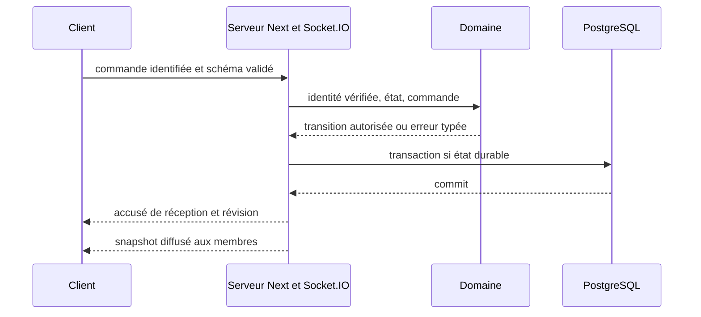

# Architecture — Incision

Version initiale alignée sur l'énoncé final, **2 octobre 2026**. Document de conception, pas preuve de fonctionnement. Le dépôt contient encore le squelette Next.js; modules, migrations, sessions et événements sont à implémenter.

## 1. Autorité et périmètre

L'[énoncé final](Web-V-Travail-de-session.pdf) prime pour les contraintes et la notation. Le [cahier remis](cahier-des-charges-incision.pdf) reste inchangé : ses choix incompatibles sont remplacés explicitement dans [EXIGENCES.md](EXIGENCES.md). La [DA V3 complète](da/da_incision.pdf), 24 pages vérifiées le 3 octobre, guide le rendu sans modifier les règles du jeu ni les obligations DES. Philippe confirme le nom Incision et impose un hébergement sans dépense personnelle. Objectif interne : lundi 5 octobre; remise annoncée : mercredi 7 octobre, heure à confirmer.

**Checkpoint :** GitHub **et** Discord OAuth, PostgreSQL avec migrations, création/admission par code et présence temps réel, HTTPS, CI, langue/thème et identité visuelle sur les pages existantes. La conception inclut déjà le jeu final et les bots; leur fonctionnement complet n'est pas une condition du checkpoint. Voir [le plan de livraison](architecture/verification.md).

## 2. Un monolithe modulaire, organisé par métier


Organisation cible, à créer au rythme des fonctionnalités :

```text
apps/web/                 Pages, composants, adaptateurs HTTP/Socket.IO, composition
packages/domain/          identity/, rooms/, racing/, texts/, results/ : règles pures
packages/contracts/       Schémas Zod, commandes, événements et erreurs publiques
packages/database/        Drizzle, migrations, dépôts et seed
```

Les cas d'usage serveur orchestrent les règles et transactions. Le domaine ne dépend ni de React, ni de Socket.IO, ni de Drizzle. Un rôle d'hôte fourni par le client n'est jamais cru. Pas de microservices, Redis ou infrastructure multi-instance pour le checkpoint.

## 3. Choix d'implémentation

| Sujet | Base retenue pour la prochaine tranche | Vérification avant validation |
|---|---|---|
| Hébergement | Aucun serveur du cégep. Piste prioritaire : VM Ubuntu sous crédit Azure for Students, Node + PostgreSQL + volume persistant + HTTPS, sans achat ni passage payant. | Admissibilité, crédit restant, région/taille disponibles, estimation VM/disque/IP/trafic jusqu'à correction, DNS et TLS. Repli Render Free + Neon Free uniquement avec validation du prof pour TECH-05; aucun serveur provisionné. |
| Temps réel | Socket.IO au même domaine que Next.js; instance unique. | Prototype production à deux navigateurs; [ADR-0001](adr/0001-temps-reel.md). |
| Exécution TS | Node 24 / npm; `tsx` pour le serveur personnalisé en dev et au lancement du build Next en production. Packages exportant leurs sources TS, `transpilePackages` côté Next. | `tsx` devient une dépendance d'exécution. Tester installation propre et rechargement dev; pas de `output: standalone`. Scripts à implémenter. |
| Authentification | Priorité de prototype : Auth.js, GitHub + Discord + Credentials, sessions JWT de la bibliothèque; mots de passe locaux scrypt. Comptes et identités persistés par Drizzle. | Prouver les trois parcours et la lecture de session dans Socket.IO. Credentials ne crée pas les comptes : inscription/seed et vérification du hash sont applicatifs. Schéma physique après prototype. |
| Confidentialité | Identité OAuth par fournisseur + identifiant stable, sans courriel conservé; pas de fusion automatique par pseudo ou courriel. | Lier un fournisseur exige session de compte et preuve OAuth. Pas de courriel fictif pour contourner une bibliothèque. |
| Validation / tests | Zod à toutes les frontières, Vitest pour règles pures, Playwright pour parcours; tests SQL sur PostgreSQL réel. | Contrats Socket.IO, concurrence d'admission, comptes locaux de test. |
| UI | Dictionnaires FR/EN centralisés; locale en cookie, défaut navigateur; thème système puis préférence sauvegardée, initialisation avant affichage. | Métadonnées/erreurs traduites, persistance, absence de flash; tokens issus de la DA complète. |
| CI/CD | Actions à chaque push et PR : lint, `tsc --noEmit`, unités, build. Déploiement automatique de `main` après succès. | Branche de travail → `dev` → `main`. Aucun secret de production dans les PR; ne pas déployer toutes les branches sur la production. |

Auth.js est une **direction de prototype**, pas une intégration certifiée. Credentials exige des sessions JWT; l'ancienne table obligatoire `auth_sessions` ne doit pas imposer une implémentation incompatible. Le plugin username de Better Auth conserve une inscription avec courriel : ce n'est pas, seul, une solution au choix « sans courriel » du cahier.

## 4. Diagramme initial du modèle de données



Le membre décrit la présence dans une salle; l'entrant est un snapshot historique indépendant. Le compte relie les résultats à l'historique personnel. Les résultats de salle peuvent conserver un snapshot anonymisé des invités/bots pour restituer un graphique complet, sans compte ni historique personnel d'invité. Voir [contraintes, rétention et transactions](architecture/data-model.md).

## 5. Machine à états de la course — COURSE-01



La salle conserve une phase courante; chaque lancement crée une nouvelle manche immuable. Admissions nouvelles uniquement en attente ou aux résultats. Reprise du même entrant dans les **30 secondes** : ce n'est pas une nouvelle admission. Configuration figée et texte révélé au début du **décompte de 3 secondes**. Une fermeture exceptionnelle faute d'humain ne fabrique pas une course achevée. Voir [états, départs et classement](architecture/state-machines.md).

## 6. Approche prévue pour les bots

Cinq profils : Noob 10–20 MPM / 12 % d'erreurs; Débutant 20–35 / 8 %; Intermédiaire 35–60 / 5 %; Expert 70–100 / 2 %; Impossible, proposition 140–170 / 0,5 %. Ces valeurs initiales suivent BOT-01; ajustements documentés après mesure.

Le serveur injecte **une graine et une horloge** dans un moteur pur. Celui-ci produit des intentions de frappe horodatées, soumises aux mêmes règles de validation, correction et bonus que les humains. Les délais combinent vitesse du profil, variation pseudo-aléatoire, pauses et difficulté des mots. Pas de `Math.random()` ni d'horloge réelle dans la règle testée. Même seed + même texte/configuration + mêmes événements externes = même simulation.

Les bots sont identifiés, comptent dans les 2–30 participants, jamais comme spectateurs ou hôtes. Tests : reproductibilité, variation de cadence, erreurs corrigées en mode obligatoire, ralentissement et bonus. L'ADR des bots sera finalisé avec les mesures du moteur, avant la remise finale.

## 7. Flux temps réel et persistance



Pendant la frappe, le serveur valide des lots séquencés et diffuse une projection compacte, sans SQL par touche. Cible initiale : 10 envois/s maximum par joueur, 4 diffusions/s avec interpolation. À la fin, résultat, séries MPM, erreurs agrégées et bonus sont persistés atomiquement pour réafficher les résultats. Une reconnexion reçoit un snapshot autoritaire; `socket.id` n'est pas l'identité du joueur.

## 8. Long terme sans élargir le checkpoint

**Application de la DA V3.** Conserver Abysse (#05070D), Nuit (#0C1424), Écume (#EEF2F7) et l'accent Red Line (#EB3B44); Big Shoulders Display pour les titres, Instrument Serif pour l'ambiance, Geist/Geist Mono pour l'interface/la saisie. Thème sombre de référence créative, mais préférence système par défaut dans l'application. Les exemples de 32/50 joueurs, codes de cinq caractères et décompte 5→1 dans le PDF ne sont pas des règles produit : implémenter 30 maximum, six caractères et 3→1. Garder les animations facultatives, sans attente artificielle bloquant l'accès; les informations de tous les participants restent consultables même si la piste met seulement certains noms en relief. Le PDF source n'est pas réécrit.

Snapshots de texte/configuration, séries MPM et bots déterministes préparent la remise du 13 novembre. En revanche : pas de gestion de classe, réseau social, MFA, déploiement distribué, éditeur de texte personnel ou matchmaking avec hôte système avant les exigences notées. La piste verticale reste la signature; les effets ne nuisent pas à la lisibilité, au clavier ou aux contrastes.

Références consultées : [Next.js](https://nextjs.org/docs/app/guides/custom-server), [Credentials Auth.js](https://authjs.dev/reference/core/providers/credentials), [username Better Auth](https://better-auth.com/docs/plugins/username). Les choix non imposés et leurs limites figurent dans [EXIGENCES.md](EXIGENCES.md).
