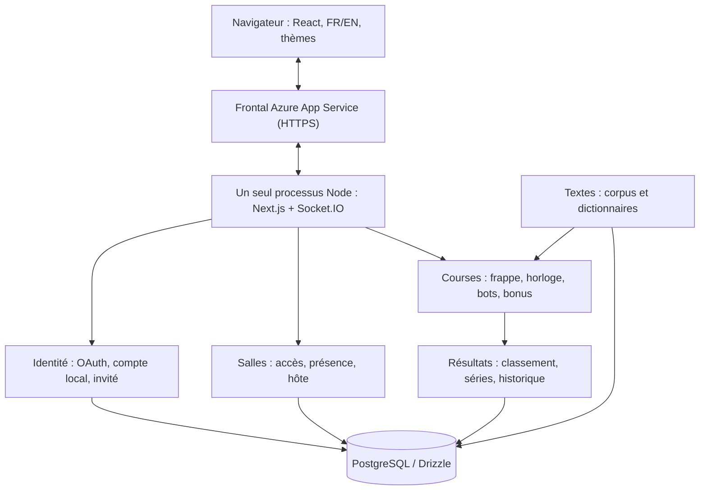
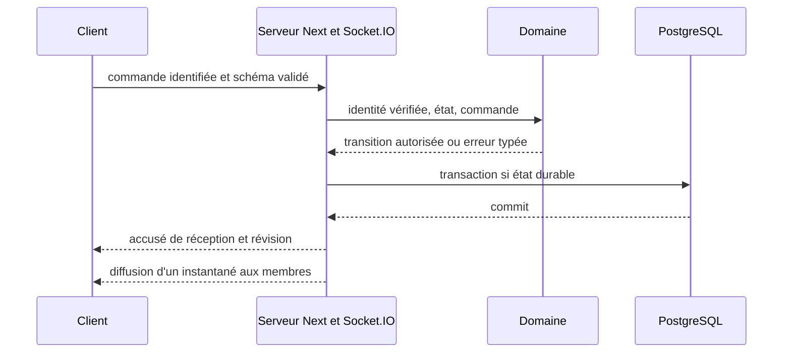

# Architecture — Incision

Version initiale alignée sur l'énoncé final, **2 octobre 2026**. Document de conception, et non une preuve que quoi que ce soit fonctionne. Livré jusqu'ici : l'intégration continue, le serveur personnalisé Next.js + Socket.IO déployé sur Azure App Service, le schéma PostgreSQL avec migrations versionnées, l'authentification (sessions Auth.js vérifiées en HTTP et sur Socket.IO), la direction artistique appliquée à l'interface et les salles par code avec présence en direct sur Socket.IO; les courses restent à implémenter.

## 1. Autorité et périmètre

L'[énoncé final](Web-V-Travail-de-session.pdf) prévaut pour les contraintes et l'évaluation. Le [cahier des charges remis](cahier-des-charges-incision.pdf) reste inchangé : ses choix incompatibles sont explicitement remplacés dans [EXIGENCES.md](EXIGENCES.md). La [direction artistique complète V3](da/da_incision.pdf), 24 pages vérifiées le 3 octobre, guide le rendu sans changer les règles du jeu ni les obligations DES. Je garde le nom Incision et j'héberge le projet sans dépense personnelle. Cible interne : lundi 5 octobre; remise annoncée : mercredi 7 octobre, 23h59.

**Checkpoint :** OAuth GitHub **et** Discord, PostgreSQL avec migrations, création/admission par code et présence en temps réel, HTTPS, intégration continue, langue/thème et identité visuelle sur les pages existantes. La conception inclut déjà le jeu final et les bots; leur fonctionnement complet n'est pas une condition du checkpoint. Voir [le plan de livraison](architecture/verification.md).

## 2. Un monolithe modulaire, organisé par domaine métier



Organisation cible, à créer au fil des fonctionnalités :

```text
apps/web/                 Pages, composants, adaptateurs HTTP/Socket.IO, composition
packages/domain/          identity/, rooms/, racing/, texts/, results/ : règles pures
packages/contracts/       Schémas Zod, commandes, événements et erreurs publiques
packages/database/        Drizzle, migrations, repositories et seed
```

Les cas d'utilisation serveur orchestrent les règles et les transactions. Le domaine ne dépend ni de React, ni de Socket.IO, ni de Drizzle. Un rôle d'hôte fourni par le client n'est jamais tenu pour fiable. Pas de microservices, de Redis ni d'infrastructure multi-instance pour le checkpoint.

## 3. Choix d'implémentation

| Sujet | Base retenue pour la prochaine tranche | Vérification avant validation |
|---|---|---|
| Hébergement | D-13 / [ADR-0002](adr/0002-hosting.md) : Azure App Service (Linux, Node 24, une instance B2, crédit étudiant) + forfait gratuit de Neon PostgreSQL; déploiement zip de `main` par GitHub Actions. | Smoke test à chaque déploiement : commit déployé, Neon joignable, ping WebSocket ([DEPLOYMENT.md](DEPLOYMENT.md)). L'enseignant a accepté le serveur géré pour TECH-05. |
| Temps réel | Socket.IO sur le même domaine que Next.js; instance unique. | Prototype en production avec deux navigateurs; [ADR-0001](adr/0001-realtime.md). |
| Exécution TS | Node 24 / npm; `tsx` pour le serveur personnalisé en dev et pour lancer le build Next en production. Paquets qui exportent leurs sources TS, `transpilePackages` côté Next. | `tsx` devient une dépendance d'exécution. Tester une installation propre et le rechargement en dev; pas de `output: standalone`. Fait dans CP-02 : `apps/web/server.ts`, version empaquetée testée en mode production. |
| Authentification | [ADR-0003](adr/0003-authentication.md) : Auth.js v5 (`next-auth@5.0.0-beta.32`, version épinglée), sessions JWT sans adaptateur, GitHub + Discord + Credentials; nos tables `accounts`/`oauth_identities` (sans courriel); mots de passe locaux hachés avec scrypt. | CP-04 : sessions liées à `accounts.session_version`, 24 h à compter de la connexion, révoquées à la déconnexion en HTTP et sur Socket.IO (tests unitaires, PostgreSQL et Playwright). Connexions GitHub, Discord et locales prouvées en production le 7 octobre. Les premiers essais de Discord y ont échoué sur son paramètre d'émetteur (issuer, RFC 9207), un problème corrigé et vérifié le jour même. |
| Confidentialité | Identité OAuth par fournisseur + identifiant stable, sans courriel stocké; aucune fusion automatique par pseudonyme ou par courriel. | Lier un fournisseur exige une session de compte et une preuve OAuth. Aucun faux courriel pour contourner une bibliothèque. |
| Validation / tests | Zod à chaque frontière, Vitest pour les règles pures, Playwright pour les parcours utilisateur; tests SQL sur un vrai PostgreSQL. | Contrats Socket.IO, concurrence des admissions, comptes de test locaux. |
| Interface | Dictionnaires FR/EN centralisés; langue dans un cookie, celle du navigateur par défaut; thème système puis préférence enregistrée, initialisé avant l'affichage. | Métadonnées/erreurs traduites, persistance, aucun flash; jetons tirés de la direction artistique complète. |
| CI/CD | Actions à chaque push et PR : lint, `tsc --noEmit`, tests unitaires, build. Déploiement automatique de `main` après succès. | Branche de travail → `dev` → `main`. Aucun secret de production dans les PR; ne pas déployer chaque branche en production. |

Auth.js est une **piste de prototype**, et non une intégration certifiée. Credentials exige des sessions JWT; l'ancienne table obligatoire `auth_sessions` ne doit pas imposer une implémentation incompatible. Le plugin username de Better Auth conserve tout de même une inscription avec courriel : à lui seul, il ne constitue pas une solution au choix « sans courriel » du cahier des charges.

## 4. Diagramme initial du modèle de données


Ce diagramme est le modèle cible. Ce qui est migré aujourd'hui est décrit dans [le schéma livré](architecture/data-model.md#delivered-schema). Le membre (member) décrit la présence dans une salle; le concurrent (entrant) est un instantané historique indépendant. Le compte relie les résultats à l'historique personnel. Les résultats de salle peuvent conserver un instantané anonymisé des invités/bots afin d'afficher un graphique complet, sans compte ni historique personnel pour les invités. Voir [contraintes, conservation et transactions](architecture/data-model.md).

## 5. Machine à états d'une course — COURSE-01


Les noms d'états sont les noms officiels de COURSE-01 : EN_ATTENTE, DECOMPTE, EN_COURSE, RESULTATS et FERMEE. La salle conserve une phase courante; chaque lancement crée une nouvelle manche immuable. Les nouvelles admissions ne se font qu'en attente ou aux résultats. Reprise par le même concurrent dans un délai de **30 secondes** : ce n'est pas une nouvelle admission. Configuration figée et texte révélé au début du **décompte de 3 secondes**. Une fermeture exceptionnelle faute d'humain ne produit pas de course terminée. Voir [états, départs et classement](architecture/state-machines.md).

## 6. Approche prévue pour les bots

Cinq profils : Noob 10–20 MPM (mots par minute) / 12 % d'erreurs; Débutant 20–35 / 8 %; Intermédiaire 35–60 / 5 %; Expert 70–100 / 2 %; Impossible, proposé à 140–170 / 0,5 %. Ces valeurs initiales suivent BOT-01; ajustements documentés après mesure.

Le serveur injecte **une graine (seed) et une horloge** dans un moteur pur. Le moteur produit des intentions de frappe horodatées, soumises aux mêmes règles de validation, de correction et de bonus que les humains. Les délais combinent la vitesse du profil, une variation pseudo-aléatoire, des pauses et la difficulté des mots. Aucun `Math.random()` ni aucune horloge réelle dans la règle testée. Même graine + même texte/configuration + mêmes événements externes = même simulation.

Les bots sont identifiés et comptent parmi les 2–30 participants, jamais comme spectateurs ni comme hôtes. Tests : reproductibilité, variation de cadence, erreurs corrigées en mode correction obligatoire, ralentissement et bonus. L'ADR des bots sera finalisé avec les mesures du moteur, avant la remise finale.

## 7. Flux temps réel et persistance



Pendant la frappe, le serveur valide des lots séquencés et diffuse une projection compacte, sans requête SQL à chaque frappe. Cible initiale : au plus 10 envois/s par joueur, 4 diffusions/s avec interpolation. À la fin, le résultat, les séries MPM, les erreurs agrégées et les bonus sont persistés de façon atomique pour que les résultats puissent être réaffichés. Une reconnexion reçoit un instantané qui fait autorité; `socket.id` n'est pas l'identité du joueur.

## 8. Long terme sans élargir le checkpoint

**Application de la direction artistique.** La direction artistique finale (27 pages, 6 octobre) et sa traduction prête pour le code [`apps/design/`](../apps/design/README.md) (jetons, composants, 17 écrans de référence, logos) sont la source de vérité visuelle : neutres de nuit Abysse/Nuit, un seul accent Red Line, lumières des coureurs, Big Shoulders Display pour les titres, Instrument Serif pour un mot d'ambiance, Geist/Geist Mono pour l'interface et le texte à taper, thème clair « Aube ». Le thème sombre est la référence créative, mais l'application suit par défaut la préférence système (DES-05). Le design précède l'énoncé final : ses exemples de 50 coureurs, de code à cinq caractères et de 5→1 ne sont pas des règles du produit (maximum de 30, six caractères, 3→1; la piste reste lisible jusqu'à 50, comme marge). Les adaptations sont listées dans le choix D-15. Garder les animations facultatives, sans attente artificielle qui bloque l'accès; les informations de chaque participant restent disponibles même si la piste ne met en valeur que certains noms. Mes fichiers de design ne sont pas réécrits.

Les instantanés de texte/configuration, les séries MPM et les bots déterministes préparent la remise du 13 novembre. En revanche : pas de gestion de classe, de réseau social, de MFA, de déploiement distribué, d'éditeur de textes personnels ni de matchmaking avec un hôte système avant les exigences évaluées. La piste verticale reste la signature; les effets ne nuisent ni à la lisibilité, ni à l'usage du clavier, ni au contraste.

Références consultées : [Next.js](https://nextjs.org/docs/app/guides/custom-server), [Auth.js Credentials](https://authjs.dev/reference/core/providers/credentials), [Better Auth username](https://better-auth.com/docs/plugins/username). Les choix qui ne sont pas imposés, et leurs limites, sont listés dans [EXIGENCES.md](EXIGENCES.md).
