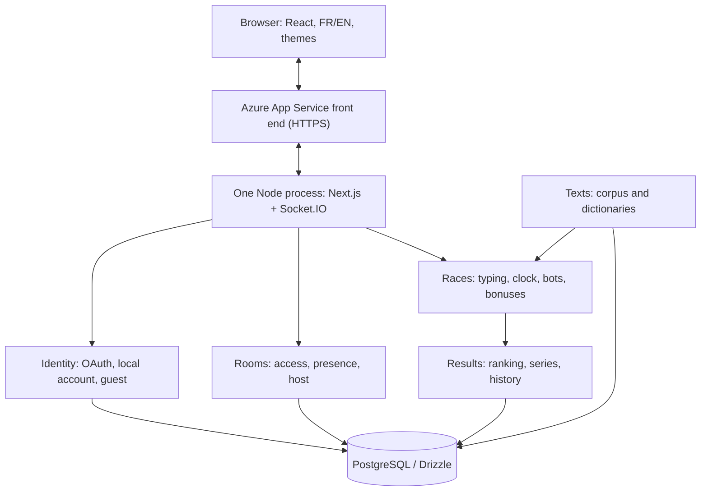
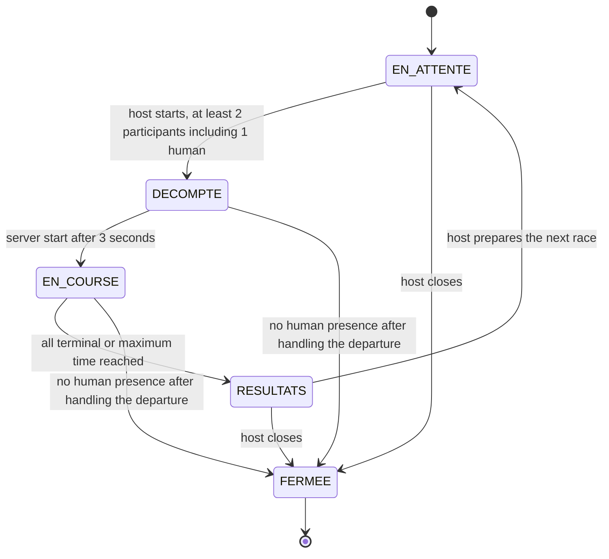
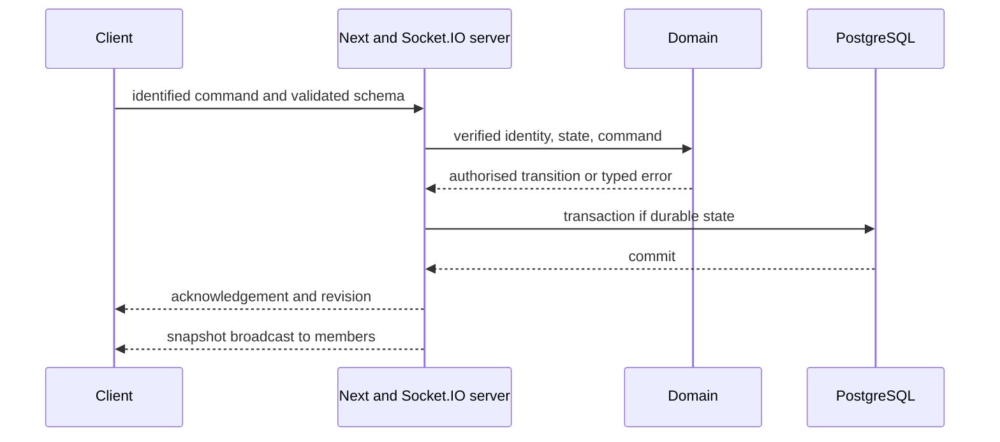

# Architecture — Incision

Initial version aligned with the final brief, **October 2, 2026**. Design document, not proof that anything works. The repository still contains the Next.js skeleton; modules, migrations, sessions and events are still to be implemented.

## 1. Authority and scope

The [final brief](Web-V-Travail-de-session.pdf) prevails for constraints and grading. The [submitted specification](cahier-des-charges-incision.pdf) stays unchanged: its incompatible choices are explicitly replaced in [EXIGENCES.md](EXIGENCES.md). The [complete art direction V3](da/da_incision.pdf), 24 pages checked on October 3, guides the rendering without changing the game rules or the DES obligations. Philippe confirms the name Incision and requires hosting with no personal expense. Internal target: Monday, October 5; announced submission: Wednesday, October 7, time to be confirmed.

**Checkpoint:** GitHub **and** Discord OAuth, PostgreSQL with migrations, creation/admission by code and realtime presence, HTTPS, CI, language/theme and visual identity on the existing pages. The design already includes the final game and the bots; their full operation is not a checkpoint condition. See [the delivery plan](architecture/verification.md).

## 2. A modular monolith, organised by business domain



Target organisation, to be created as the features come:

```text
apps/web/                 Pages, components, HTTP/Socket.IO adapters, composition
packages/domain/          identity/, rooms/, racing/, texts/, results/: pure rules
packages/contracts/       Zod schemas, commands, events and public errors
packages/database/        Drizzle, migrations, repositories and seed
```

Server use cases orchestrate rules and transactions. The domain depends on neither React, nor Socket.IO, nor Drizzle. A host role supplied by the client is never trusted. No microservices, Redis or multi-instance infrastructure for the checkpoint.

## 3. Implementation choices

| Topic | Basis chosen for the next slice | Verification before validation |
|---|---|---|
| Hosting | D-13 / [ADR-0002](adr/0002-hosting.md): Azure App Service (Linux, Node 24, one B2 instance, student credit) + Neon PostgreSQL free plan; zip deployment of `main` by GitHub Actions. | Smoke test on every deployment: deployed commit, Neon reachable, WebSocket ping ([DEPLOYMENT.md](DEPLOYMENT.md)). Teacher accepted the managed server for TECH-05. |
| Realtime | Socket.IO on the same domain as Next.js; single instance. | Two-browser production prototype; [ADR-0001](adr/0001-realtime.md). |
| TS execution | Node 24 / npm; `tsx` for the custom server in dev and when launching the Next build in production. Packages exporting their TS sources, `transpilePackages` on the Next side. | `tsx` becomes a runtime dependency. Test a clean install and dev reload; no `output: standalone`. Done in CP-02: `apps/web/server.ts`, packaged release tested in production mode. |
| Authentication | [ADR-0003](adr/0003-authentication.md): Auth.js v5 (`next-auth@5.0.0-beta.32`, pinned), JWT sessions without adapter, GitHub + Discord + Credentials; our `accounts`/`oauth_identities` tables (no email); local passwords hashed with scrypt. | Spike of October 6 proved identity, no-email token and Socket.IO session decoding on Next 16; real GitHub/Discord sign-ins, expiry and socket revocation are proven in CP-04. |
| Privacy | OAuth identity per provider + stable identifier, with no email stored; no automatic merging by nickname or email. | Linking a provider requires an account session and OAuth proof. No fake email to work around a library. |
| Validation / tests | Zod at every boundary, Vitest for pure rules, Playwright for user flows; SQL tests on real PostgreSQL. | Socket.IO contracts, admission concurrency, local test accounts. |
| UI | Centralised FR/EN dictionaries; locale in a cookie, browser default; system theme then saved preference, initialised before display. | Translated metadata/errors, persistence, no flash; tokens taken from the complete art direction. |
| CI/CD | Actions on every push and PR: lint, `tsc --noEmit`, unit tests, build. Automatic deployment of `main` after success. | Working branch → `dev` → `main`. No production secret in PRs; do not deploy every branch to production. |

Auth.js is a **prototype direction**, not a certified integration. Credentials requires JWT sessions; the former mandatory `auth_sessions` table must not force an incompatible implementation. Better Auth's username plugin still keeps a sign-up with email: on its own, it is not a solution to the specification's "no email" choice.

## 4. Initial data model diagram


This diagram is the target model. What is migrated today is described in [the delivered schema](architecture/data-model.md#delivered-schema-cp-03-migration-0000_init). The member describes presence in a room; the entrant is an independent historical snapshot. The account links results to the personal history. Room results may keep an anonymised snapshot of guests/bots to render a complete chart, with no account and no personal history for guests. See [constraints, retention and transactions](architecture/data-model.md).

## 5. Race state machine — COURSE-01



The state names are the official COURSE-01 names: EN_ATTENTE (waiting), DECOMPTE (countdown), EN_COURSE (racing), RESULTATS (results) and FERMEE (closed). The room keeps a current phase; each start creates a new immutable round. New admissions only while waiting or at results. Resumption by the same entrant within **30 seconds**: this is not a new admission. Configuration frozen and text revealed at the start of the **3-second countdown**. An exceptional closure for lack of a human does not produce a completed race. See [states, departures and ranking](architecture/state-machines.md).

## 6. Planned approach for bots

Five profiles: Noob 10–20 MPM (words per minute) / 12% errors; Débutant (beginner) 20–35 / 8%; Intermédiaire (intermediate) 35–60 / 5%; Expert 70–100 / 2%; Impossible, proposed 140–170 / 0.5%. These initial values follow BOT-01; adjustments documented after measurement.

The server injects **a seed and a clock** into a pure engine. The engine produces timestamped keystroke intents, subject to the same validation, correction and bonus rules as humans. Delays combine the profile's speed, pseudo-random variation, pauses and word difficulty. No `Math.random()` and no real clock in the tested rule. Same seed + same text/configuration + same external events = same simulation.

Bots are identified and count among the 2–30 participants, never as spectators or hosts. Tests: reproducibility, cadence variation, errors corrected in mandatory mode, slowdown and bonuses. The bots ADR will be finalised with the engine's measurements, before the final submission.

## 7. Realtime flow and persistence



During typing, the server validates sequenced batches and broadcasts a compact projection, with no SQL per keystroke. Initial target: at most 10 sends/s per player, 4 broadcasts/s with interpolation. At the end, the result, MPM series, aggregated errors and bonuses are persisted atomically so the results can be displayed again. A reconnection receives an authoritative snapshot; `socket.id` is not the player's identity.

## 8. Long term without widening the checkpoint

**Applying art direction V3.** Keep Abysse (#05070D), Nuit (#0C1424), Écume (#EEF2F7) and the Red Line accent (#EB3B44); Big Shoulders Display for headings, Instrument Serif for mood, Geist/Geist Mono for the interface/input. The dark theme is the creative reference, but the application defaults to the system preference. The examples of 32/50 players, five-character codes and a 5→1 countdown in the PDF are not product rules: implement a maximum of 30, six characters and 3→1. Keep animations optional, with no artificial wait blocking access; every participant's information stays available even if the track highlights only some names. The source PDF is not rewritten.

Text/configuration snapshots, MPM series and deterministic bots prepare the November 13 submission. On the other hand: no class management, social network, MFA, distributed deployment, personal text editor or matchmaking with a system host before the graded requirements. The vertical track remains the signature; effects do not harm readability, keyboard use or contrast.

References consulted: [Next.js](https://nextjs.org/docs/app/guides/custom-server), [Auth.js Credentials](https://authjs.dev/reference/core/providers/credentials), [Better Auth username](https://better-auth.com/docs/plugins/username). The choices that are not imposed, and their limits, are listed in [EXIGENCES.md](EXIGENCES.md).
