# Démarche créative

Voici comment j'ai trouvé le nom Incision, dessiné son logo et posé sa direction artistique (DES-01 à DES-03), avant de coder l'interface. Le dossier complet est [da_incision.pdf](da/da_incision.pdf) (version finale du 6 octobre 2026, 27 pages); les images ci-dessous en sont des pages. Sa traduction prête pour le code (jetons, composants, 17 écrans) se trouve dans [apps/design](../apps/design).

Ma démarche suit l'ordre réel du travail : comprendre le besoin, collectionner ce que j'aime, nommer et dessiner, construire un système, puis vérifier qu'il tient dans le produit.

## 1. Comprendre le brief

Pendant la présentation du client, j'ai noté six besoins. Le site doit être le fun, car les élèves ont entre 12 et 17 ans. Un élève doit pouvoir jouer et voir un autre le dépasser. Les positions de chaque joueur doivent être visibles, comme dans Mario Kart. L'indicateur doit rester discret, parce que les élèves regardent plus leur clavier que l'écran. Il n'y a pas de maximum : des groupes entiers d'environ 32 personnes. Et la DA doit être prononcée, atypique; si on a une série favorite, on peut en intégrer les éléments.

J'en ai tiré cinq contraintes de design :

- **Le texte d'abord.** Rien ne passe jamais sous le texte à taper.
- **Vision périphérique.** Ma position se lit du coin de l'œil.
- **De 2 à 50 coureurs.** La course reste lisible pour une classe entière (l'énoncé final plafonne une salle à 30 participants; la piste garde la marge).
- **Clin d'œil, pas copie.** Les fans reconnaissent One Piece, les autres profitent du jeu.
- **Deux thèmes, deux écrans.** Sombre et clair, ordinateur et tablette.

Ma méthode : je ne pars pas d'une page blanche. Je vais sur les sites que j'aime, je capture ce qui me frappe, je nomme pourquoi ça marche (une couleur, un mouvement, une typo, une composition), je transforme chaque emprunt en règle que le produit doit respecter, et je vérifie chaque règle sur un écran du site.

## 2. Moodboard : cinq références

Toutes les images sont mes propres captures (septembre et octobre 2026). Chaque référence apporte une chose précise à Incision.

**Overworld Audio — la nuit qui s'allume.** Un écran d'attente, puis le paysage qui se dévoile d'un coup; une seule température, bleu nuit et brume; quelques points de lumière qui guident le regard; une serif élégante à côté de capitales espacées. Dans Incision : le fond Abysse où seuls les coureurs s'allument, Instrument Serif pour l'ambiance, Geist Mono espacée pour l'interface, et un chargement « la mer se lève ».

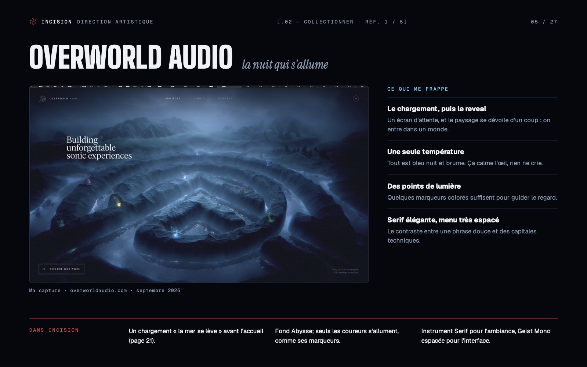

**Gravity — le cosmos en orbite.** Des orbites concentriques en pointillés autour du titre, une navigation qui flotte comme des coordonnées [.ENTRE CROCHETS], un titre condensé et massif, des couleurs psychédéliques sur un noir profond. Dans Incision : les orbites deviennent la salle d'attente, les [.ÉTIQUETTES] marquent la navigation et les états, Big Shoulders Display pour les titres.

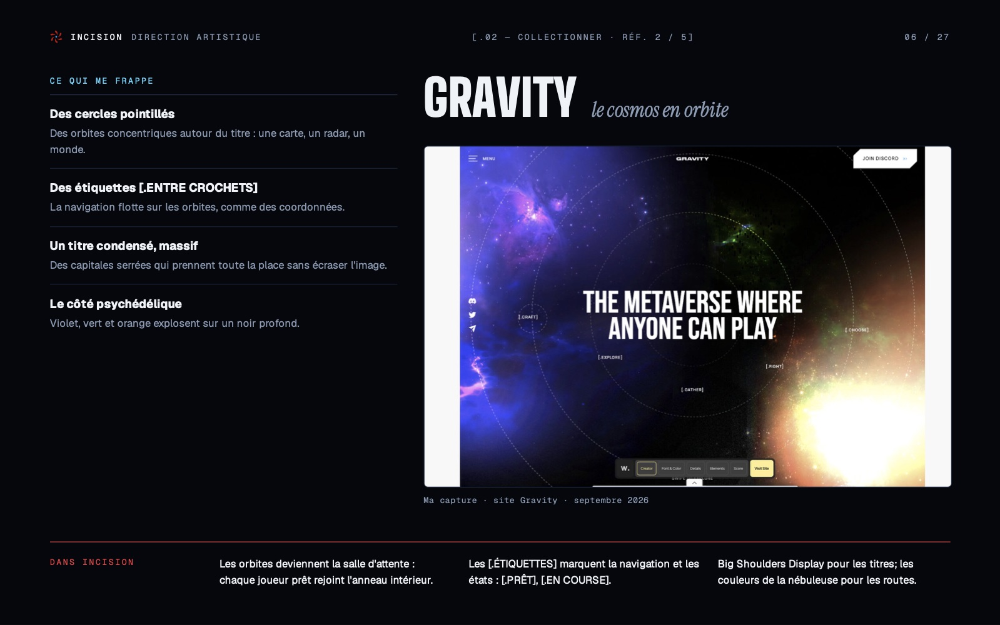

**One Piece — le rouge, et Next.js — la rigueur.** De one-piece.com, je ne garde qu'un rouge franc et chaud, assumé sur tout le bandeau : l'énergie du manga en une couleur. Je laisse le logo, le drapeau et les illustrations, qui appartiennent à l'œuvre. De nextjs.org, je garde le noir profond, les bordures d'un pixel, une grille discrète et la police Geist, faite pour l'interface que je vais coder. Dans Incision : le rouge devient la « Red Line » (ligne d'arrivée, action principale, incision du logo, rien d'autre), avec Geist pour l'interface et Geist Mono pour le texte de course.

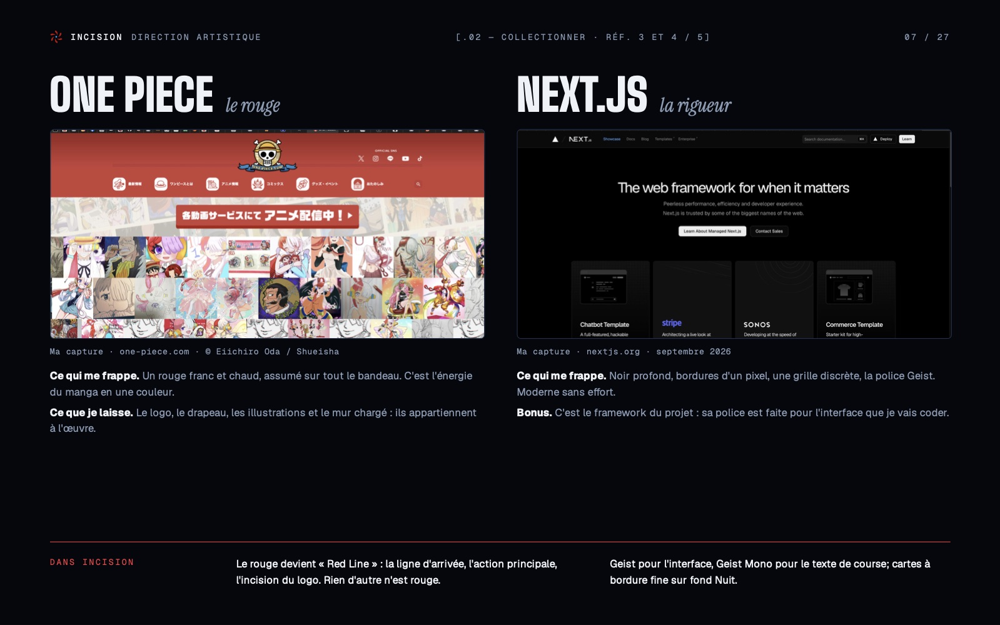

**Lando Norris — la coupe et le contraste.** Une bande de casque coupe le portrait en deux, exactement le geste d'Incision; des titres à deux voix, un mot en serif fine à côté d'une grotesque grasse; des lignes topographiques pâles comme le tracé d'un circuit; un seul accent fluo. Dans Incision : des titres à deux voix (un mot en Instrument Serif dans une ligne en Big Shoulders), des courants marins pâles derrière la piste, un seul accent, le rouge.

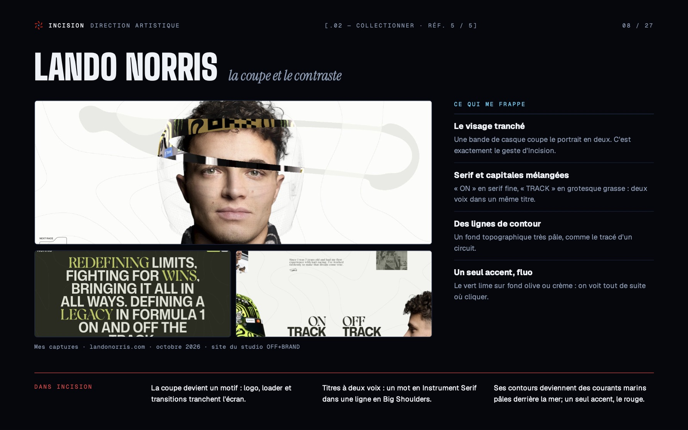

**La formule : « Nuit de course »** : sombre, rapide, lisible, avec un clin d'œil. Je garde une ambiance sombre et cinématographique, un seul accent chaud, des lumières qui guident et une interface nette. Je laisse les visuels officiels de One Piece, la 3D lourde, le texte posé sur une image chargée et les accents qui se battent.

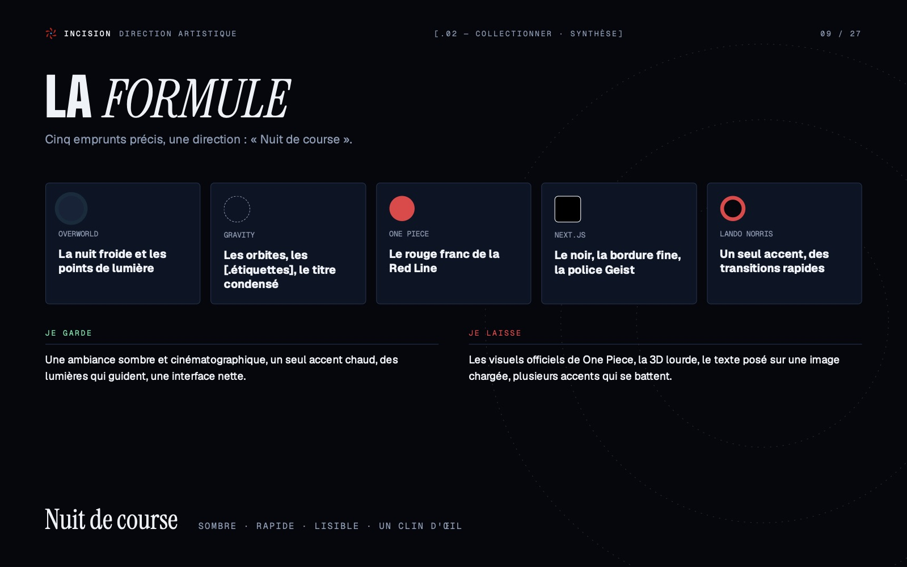

## 3. Le nom (DES-01)

**Les noms envisagés.** Le 21 septembre, j'ai d'abord cherché un mot en posant au mode IA de Google quatre questions de plus en plus précises; j'ai écarté toutes les suggestions :

| Question | Suggestions | Pourquoi je les ai écartées |
|---|---|---|
| Rapide et efficace ? | Streamlining, lean, kaizen | Juste, mais du vocabulaire d'entreprise |
| En nom de système ? | StreamlineOS, OptiFlow, Catalyst | Des noms de logiciel, pas de jeu |
| Pour un typeracer ? | Kinetic, KeyStrike, Velo, Cadence | On se rapproche de la frappe |
| Un seul mot ? | Pulse, Blitz, Dex, Cadence | Cadence me plaisait, sans me convaincre |

Tous ces mots étaient justes, mais aucun n'avait d'histoire : n'importe quel jeu pourrait les porter.

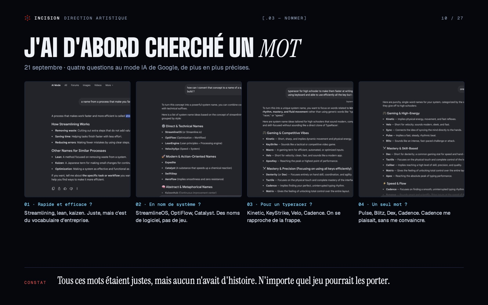

**Le déclic : chercher dans ma propre culture.** J'ai pris une minute et je me suis demandé : pourquoi ne pas aller chercher dans One Piece ? Dans la version française de One Piece, *Incision* est le nom de Soru (剃, « Shave » en anglais), l'un des Six Pouvoirs : on frappe le sol une dizaine de fois en un instant pour se déplacer plus vite que l'œil. Le double sens est la raison de mon choix : frapper le sol pour aller plus vite qu'un humain; frapper le clavier pour aller plus vite que la veille. Le nom est court, se dit en français et en anglais, est lié au geste de frapper vite et juste, se comprend sans connaître l'œuvre et reste un vrai clin d'œil pour les fans.

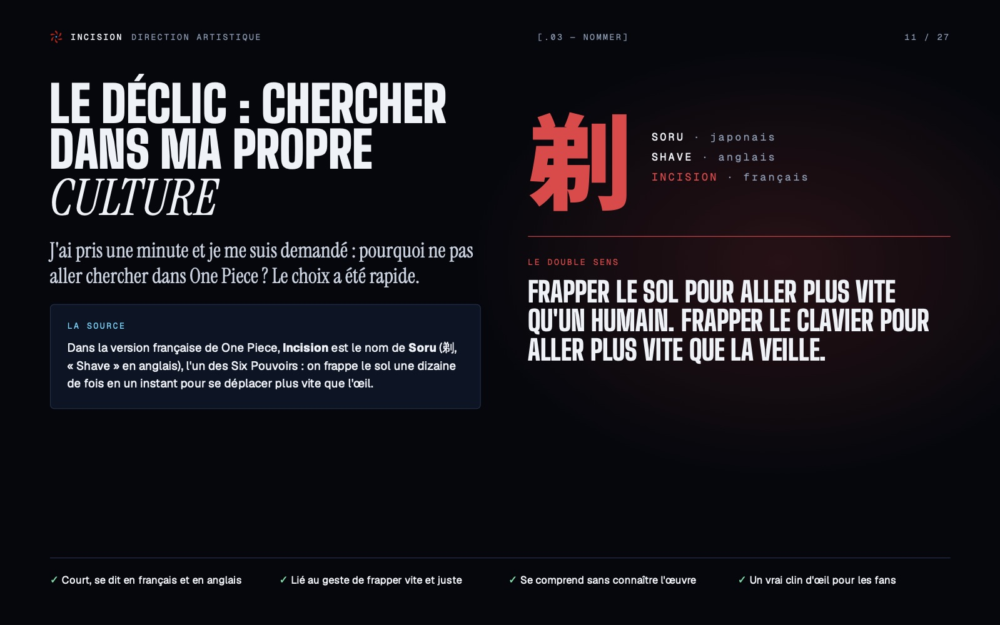

**Vérification d'originalité (octobre 2026).** Aucun jeu de frappe, ni aucun autre jeu, ne porte ce nom. Incision Academy, une plateforme de formation chirurgicale, l'utilise dans le domaine médical : un public et un produit sans rapport. Je garde Incision : seul dans son domaine, le mot se suffit et porte une signification plus forte que n'importe quelle variante.

## 4. La piste signature (DES-04)

Avant d'inventer, j'ai joué aux deux jeux de frappe les plus connus et noté ce qui coince. TypeRacer a une métaphore immédiate, mais un couloir par joueur : à 32 élèves, la piste pousse le texte hors de l'écran, et la piste est au-dessus du texte, donc on quitte sa ligne pour voir sa place. TypeRacer Turbo affiche un rang et une mini-carte lisibles, mais seulement quatre couloirs, un mot à la fois, et le décor prend l'écran. La course horizontale marche à quatre; une classe entière demande une autre forme.

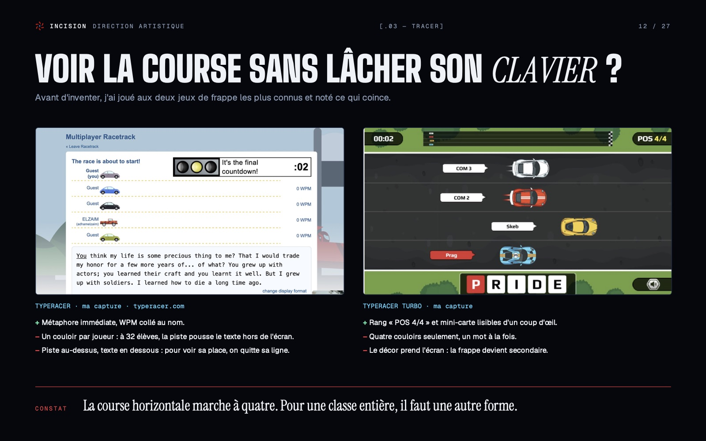

Le déclic est venu de la façon dont One Piece montre la course de la Génération Terrible vers le Nouveau Monde : à l'archipel Sabaody, Shakky explique que, quelle que soit leur route, toutes mènent à la Red Line. La piste d'Incision est donc **verticale** (une colonne étroite à côté du texte, qui monte vers l'arrivée), avec **une route par coureur** dans la même mer de nuit (2 ou 50 coureurs y tiennent), et **tout converge** près de la ligne, où chaque dépassement compte. Un dépassement fait pulser mon point, visible du coin de l'œil.

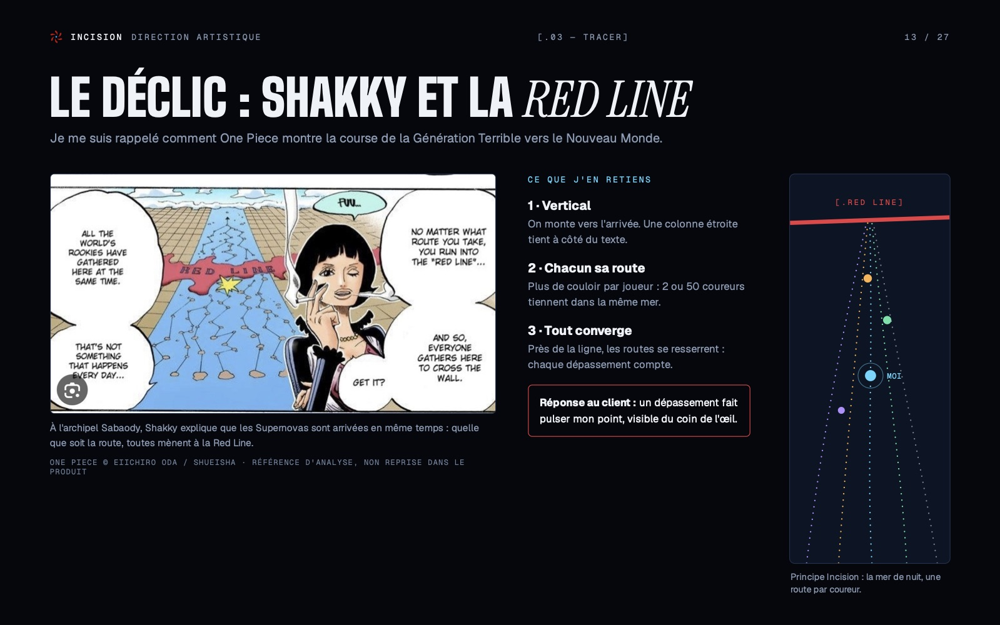

## 5. Le logo (DES-02)

**Croquis 01, abandonné.** Ma première version, « le mot tranché », a été faite avec l'aide de Claude : des capitales condensées très grasses, une seule coupe en diagonale avec un trait de lumière dans la fente, un sceau 剃 sur rouge. Je l'ai abandonnée et je la garde comme trace : trop d'effets se disputaient l'attention (coupe, lueur, sceau, kanji), la coupe disparaît sous 32 px, et c'était une police existante coupée en deux, rien que j'avais vraiment dessiné.

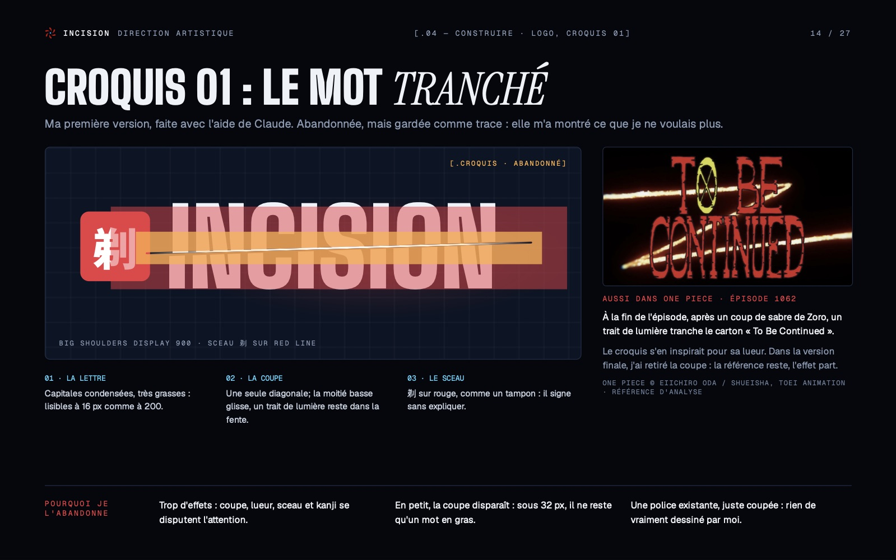

**Un symbole plutôt qu'un effet.** J'ai cherché un symbole, toujours dans One Piece : Reverse Mountain, là où la Red Line croise Grand Line et où les courants des quatre mers montent et se rejoignent; le schéma de Nami, quatre flèches vers un centre; mon premier croquis, un cercle traversé de lignes (juste, mais rigide); puis le déclic du Sharingan de Naruto, des virgules qui tournent autour d'une pupille, qui a transformé mes lignes droites en courbes espacées. Les pales rouges sont les courants des mers, qui tournent tous vers le centre; le point bleu est la mer où ils se rejoignent. Pour Incision : des élèves qui partent de partout et convergent vers la même arrivée, comme la piste.

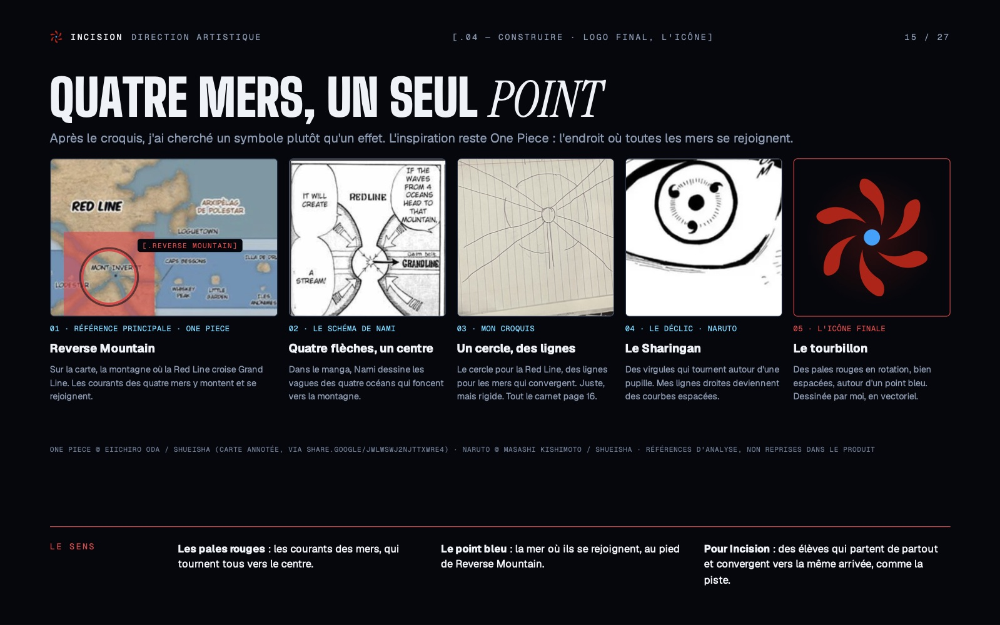

**Du carnet au vecteur.** Mes croquis au stylo, dans l'ordre, avec mes notes en marge : Reverse Mountain vue de haut; les lignes qui deviennent des pétales autour d'une pupille; « Kaléidoscope ? », les quatre routes dans le cercle qui ne frappaient pas encore comme logo, puis « normaliser cette forme sans cercle et ajouter plus de formes »; et la version finale, « plus uniforme », où le tourbillon irrégulier est rayé et où les pales deviennent égales et bien espacées. Chaque étape enlève quelque chose : le cercle, les lignes droites, les formes inégales. Il reste le mouvement des mers vers un seul point.

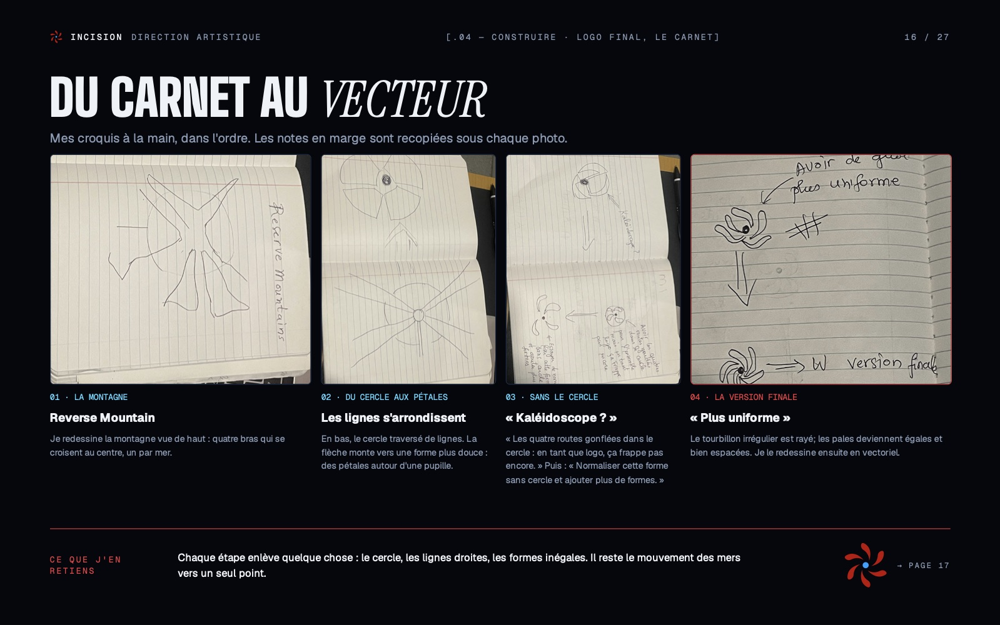

**Le logo final.** J'ai redessiné le tourbillon du carnet en vectoriel, avec un lettrage plus sobre et fermé, sans coupe ni lueur : des fûts droits aux extrémités biseautées, des formes fermées, net à toutes les tailles, qui laisse la vedette à l'icône. Deux déclinaisons : rouge, et noir / blanc. L'icône seule sert quand la place manque, et c'est le favicon. Règles : rouge sur blanc ou sur Abysse, noir ou blanc sur une photo; ne jamais étirer, recolorer une pale seule, ajouter une ombre ou une lueur; marge libre d'au moins deux fois le diamètre du point bleu.

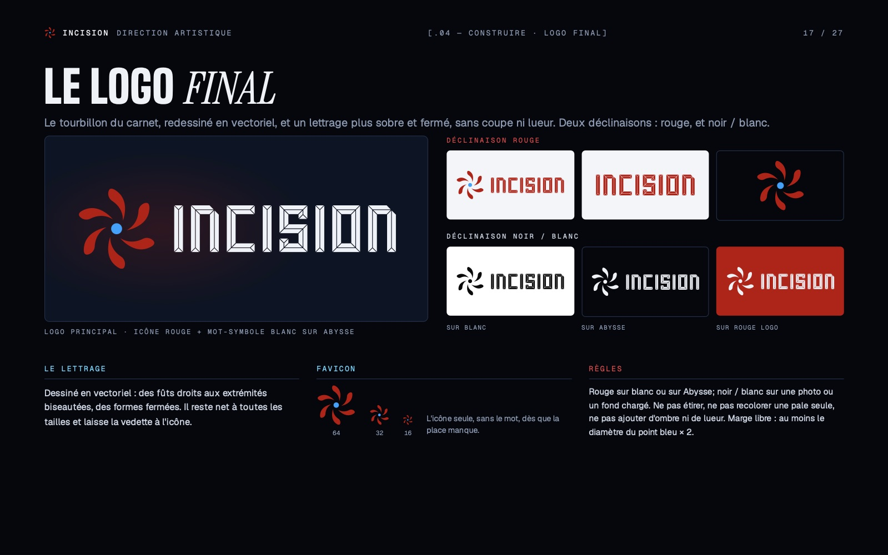

Les fichiers exportés sont dans [apps/design/logo](../apps/design/logo); le site les utilise sans modification dans [apps/web/public/brand](../apps/web/public/brand), et l'icône rouge sert de favicon ([icon.svg](../apps/web/src/app/icon.svg)).

## 6. Palette (DES-03)

La nuit d'abord, le rouge pour agir : quatre neutres froids, un seul accent chaud et des lumières réservées aux coureurs.

| Rôle | Abysse (sombre, par défaut) | Aube (clair) |
|---|---|---|
| Abysse — fond | `#05070D` | `#F3F5F8` |
| Nuit — surface | `#0C1424` | `#FFFFFF` |
| Houle — bordures | `#22324D` | `#C9D3E1` |
| Brume — texte secondaire | `#8A9BB5` | `#4A5A73` |
| Écume — texte | `#EEF2F7` | `#0A1020` |
| Red Line — logo seulement | `#BC0404` | `#BC0404` |
| Action — bouton principal | `#D41F27` | `#C81E25` |
| Ligne — traits et texte rouges sur Nuit | `#EB3B44` | `#C81E25` |
| Moi — moi, focus clavier | `#5BD6FF` | `#0077A8` |
| Or — premier, record | `#FFB347` | `#A15C00` |
| Juste — correct, voisin | `#5BE3A6` | `#08784A` |

Contrastes mesurés : Écume sur Abysse 17,9:1, Brume sur Abysse 7,1:1, traits Red Line sur Abysse 5,0:1, blanc sur le bouton 5,2:1; en Aube, encre 17,4:1 et rouge 5,2:1. Règles : le rouge veut dire arrivée, action principale ou erreur; une seule « brume Red Line » par écran, un halo rouge de 15 à 25 % derrière ce qui compte, qui respire lentement; une erreur porte aussi une forme, jamais la couleur seule. Le thème clair, Aube, a été demandé par le client : mêmes rôles, accents assombris pour garder le contraste.

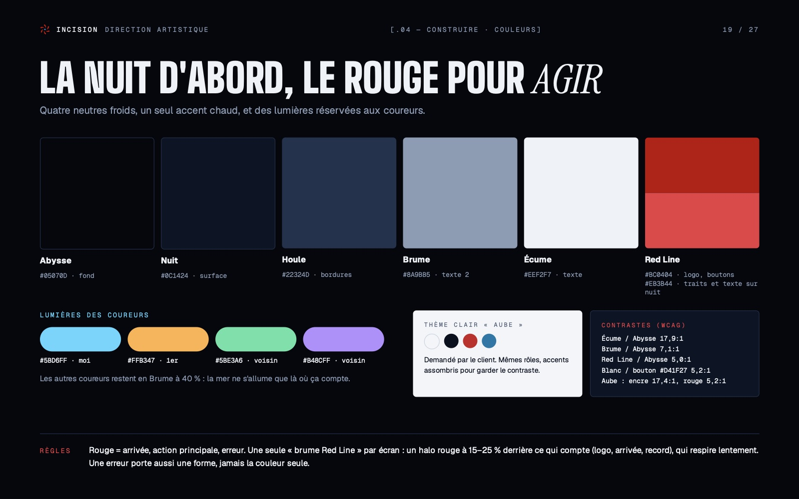

## 7. Typographies (DES-03)

Trois voix, un rôle chacune, toutes libres sous licence SIL Open Font License. J'ai abandonné Poppins : trop ronde, trop « appli scolaire ».

- **Big Shoulders Display** (800–900, capitales) : condensée et massive, comme le titre de Gravity. Titres et chiffres du compte à rebours.
- **Instrument Serif** (italique) : la phrase douce d'Overworld. Un mot clé par titre, accroches, écrans de chargement et de fin de course; jamais dans l'interface.
- **Geist et Geist Mono** : la police de Next.js. Geist pour les menus et les statistiques (16 px, interligne 1,5); Geist Mono pour les [.ÉTIQUETTES] (12 px, espacement 0,2 em) et, à chasse fixe, pour le texte à taper (22 px, interligne 2).

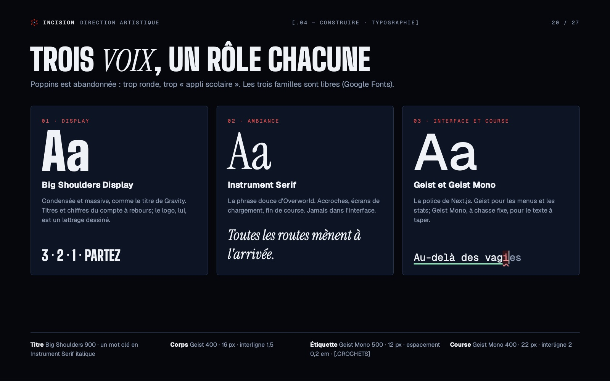

## 8. Signatures et mouvement

Quatre signatures rendent un écran d'Incision reconnaissable même sans le logo : le tourbillon qui tourne lentement (chargement, attente du départ, centre de la salle; un seul à la fois, jamais pendant la frappe), la brume Red Line, les orbites en pointillés de la salle d'attente et les routes de la course. Le mouvement suit le reveal d'Overworld : le tourbillon aspire l'écran puis s'ouvre sur la course; un dépassement fait pulser mon point deux fois; la Red Line s'illumine quand je la franchis; une erreur ne secoue jamais l'écran. Les transitions durent de 200 à 400 ms, le chargement peut être passé et ne joue qu'une fois par session, et avec « réduire les animations », tout devient un simple fondu.

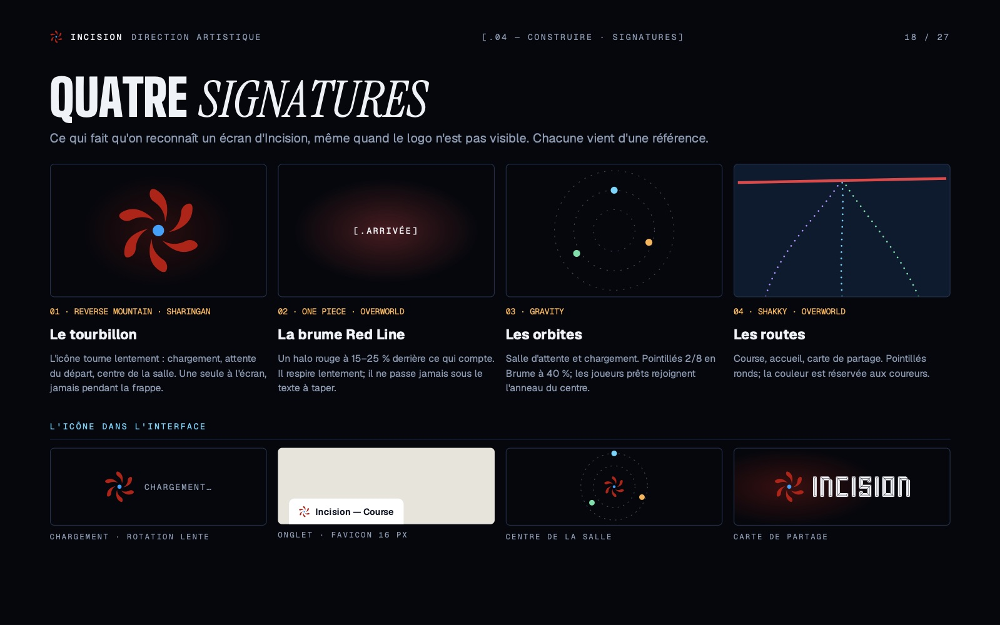

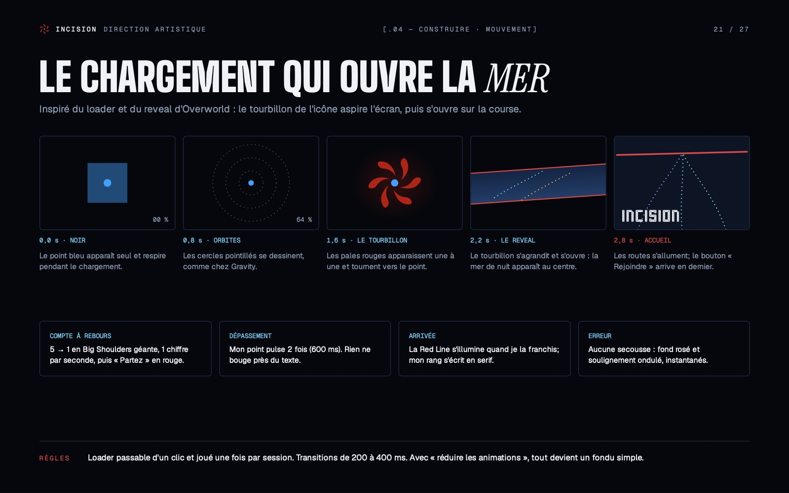

## 9. Du dossier au site

J'ai traduit le dossier dans [apps/design](../apps/design) : `tokens.css` (le seul endroit où une couleur est écrite), un README avec les composants, 17 maquettes d'écrans et des wireframes HTML. Le site charge ces jetons et les quatre polices, applique les deux thèmes sans flash et utilise mon logo et mon favicon sans modification; un test automatisé refuse toute couleur écrite en dehors des jetons.

La direction artistique a précédé l'énoncé final. Quand ils diffèrent, l'énoncé décide des règles du produit (codes de salle de 6 caractères, de 2 à 30 participants, décompte 3-2-1) et la direction artistique décide de l'apparence. Les petites adaptations faites en construisant, comme le soulignement au survol du bouton rouge pour garder le contraste AA, sont listées en D-15 dans [EXIGENCES.md](EXIGENCES.md). Ce qui ne bouge pas : le nom, le logo, la nuit et le rouge, la piste verticale et Geist Mono pour la course.

## 10. Sources et usage de l'IA

Toutes les images du dossier sont de vraies captures; aucune n'a été générée par IA. Le visuel d'océan généré des versions 1 et 2 a été retiré en version 3 et remplacé par mes captures et des tracés vectoriels. One Piece (© Eiichiro Oda / Shueisha; épisode 1062 © Toei Animation) et Naruto (© Masashi Kishimoto / Shueisha) sont des références d'analyse, jamais reprises dans le produit.

- **Mode IA de Google** : suggestions de mots pour le nom, toutes écartées (section 3).
- **Claude** : mise en page du dossier de DA, maquettes de principe, premier croquis du logo (abandonné, section 5), rédaction assistée et relecture.
- **À moi** : le choix des références, le nom Incision, la route verticale, le logo final (icône et lettrage, dessinés d'après mes croquis au stylo) et chaque décision visuelle.
