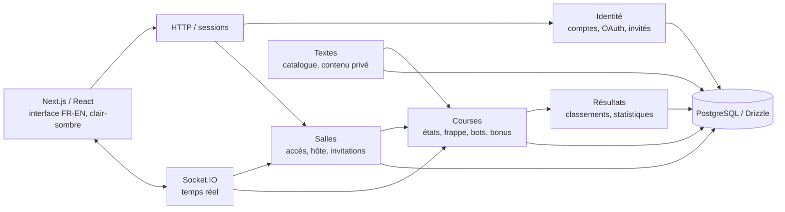

# Architecture du checkpoint 1

Statut : **proposition de conception à implémenter**, 29 septembre 2026. Ce dossier répond aux trois éléments explicitement évalués : modèle de données, machines à états, ADR temps réel. Il ne constitue pas encore une preuve de déploiement ou de fonctionnement.

## Lecture des sources

1. **Cahier des charges Incision v1.1 remis** : périmètre et choix client actuels.
2. **Direction artistique Incision v2** : intention visuelle et comportement de l'interface; la piste verticale compacte, l'accès par code/lien et la hiérarchie du texte guident les données à afficher, sans imposer la structure du serveur.
3. **Matrice des exigences détaillée** : scénarios atomiques et critères de test. Elle est antérieure au cahier remis; ses noms et décisions divergents sont à réconcilier avant l'implémentation.

Le cahier parle de **50 humains garantis en salle**, pas d'un plafond strict de 50. Les spectateurs dans ce calcul restent à confirmer. Une salle demeure entre les manches; une manche est un événement historique distinct.

## Découpage métier

Les règles de salle, de course et de classement résident dans `packages/domain`, sans dépendance à Next.js ou à Socket.IO. Les événements et leurs validations sont dans `packages/contracts`. Drizzle et les migrations sont dans `packages/database`. `apps/web` adapte HTTP et Socket.IO à ces règles. On obtient le découpage « par logique business » souhaité sans exiger plusieurs services dès le premier checkpoint. Le choix de processus est argumenté dans [ADR-0001](../adr/0001-temps-reel.md).

## Invariants à préserver

- Seul un **compte** peut créer et héberger une salle manuelle; un invité peut la rejoindre et courir. Un bot n'est jamais hôte. Une salle créée automatiquement par le matchmaking est gérée par le **système**, sans donner le rôle d'hôte à l'invité (proposition technique).
- L'hôte est un rôle de **salle**, pas de manche. Il peut observer pendant que d'autres courent. S'il quitte volontairement, le successeur choisi et présent, sinon le compte présent le plus ancien, reprend le rôle.
- La configuration et les entrants sont figés au début du compte à rebours de cinq secondes. Un nouvel arrivant observe jusqu'à la manche suivante.
- Deux coureurs prêts et connectés au minimum sont requis; un humain et un bot satisfont cette condition.
- Entraînement/évaluation sans bonus et Arcade gardent des résultats séparés. Le mode de gestion des erreurs reste une dimension distincte.
- L'annulation confirmée ne produit **aucun résultat officiel**. L'abandon et les DNF, eux, produisent des résultats partiels.
- Le serveur décide du départ, de la durée, de la progression validée, des bonus et du classement; le client affiche une projection de cet état.
- L'interface de course montre le texte en priorité et une piste verticale secondaire; le réseau envoie un classement compact, non une copie complète des frappes de tous les joueurs.
- Langue, thème et sons sont des préférences d'interface; le son démarre désactivé en contexte scolaire. Leur fonctionnement de base peut rester local au navigateur sans ajouter de donnée personnelle à PostgreSQL.

## Documents de conception

- [Modèle de données et contraintes](data-model.md)
- [Machines à états et scénarios difficiles](state-machines.md)
- [Scénarios de vérification du checkpoint](verification.md)
- [ADR-0001 : transport et déploiement temps réel](../adr/0001-temps-reel.md)

## Questions ouvertes sans invention de besoin

| Question | Choix de travail réversible | À confirmer |
|---|---|---|
| Entraînement et Évaluation sont-ils deux modes distincts ? | Même règle `STANDARD`, étiquette d'usage optionnelle; aucune statistique « Évaluation » séparée tant que non décidée. | Client |
| « Salle pleine » et spectateurs dans les 50 ? | Charge cible : 50 humains connectés; ne pas coder `50` comme capacité maximale de la table `lobbies`. | Client |
| Troisième bonus, groupes de tête/fin et durée ? | Ne pas figer les variantes dans le schéma; événements typés extensibles et règles versionnées. | Client |
| Tablette avec clavier physique ? | Séparer capacité de saisie et largeur d'écran; téléphone spectateur selon le cahier. | Client |
| Durée exacte d'une invitation ? | Usage unique confirmé dans le cahier; expiration à 24 h selon l'hypothèse H-01. | Client pour la durée |
| Qui pilote une salle créée automatiquement ? | Système avec configuration prédéfinie et départ automatique lorsque les gardes sont remplies; ni invité ni bot n'obtient le rôle d'hôte. | Client / prototype |
| Comment comparer les progressions en Arcade quand un bonus change la longueur à saisir ? | Conserver la cible effective par entrant et l'historique des bonus; la piste peut montrer une fraction normalisée, mais le classement DNF Arcade reste à valider. | Client |
| Seuils précis de fluidité ? | Les seuils de la matrice servent de cibles de test internes, non de promesse client déjà validée. | Test + client |
