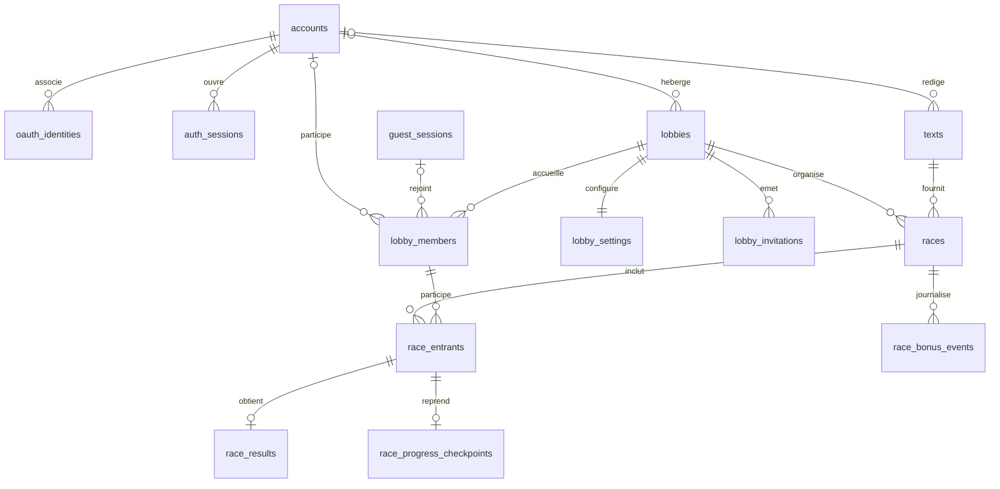

# Modèle de données PostgreSQL

Statut : **modèle conceptuel**, avant migrations Drizzle. Les noms ci-dessous sont des propositions techniques; les règles du cahier restent l'autorité. UUID pour les identifiants internes, horodatages UTC côté serveur et contraintes SQL pour les invariants durables.

## Relations principales

## Tables et contraintes

| Table | Champs structurants | Contraintes et raison |
|---|---|---|
| `accounts` | `id`, `username`, `username_canonical`, `password_hash?`, `avatar_url?`, `stats_visibility`, dates | `username_canonical` unique globalement; `password_hash` nul seulement pour un compte OAuth. Aucun courriel. Statistiques privées par défaut. |
| `oauth_identities` | `account_id`, `provider` (`GITHUB`/`DISCORD`), `provider_subject` | Couple fournisseur + sujet unique. Une identité externe ne peut pas appartenir à deux comptes. Pas de courriel fournisseur conservé. |
| `auth_sessions` | `account_id`, `token_hash`, `expires_at`, `remember_me`, `revoked_at?` | Jeton brut uniquement en cookie sécurisé; valeur hachée en BD. Durée « se souvenir de moi » de 30 jours : hypothèse H-05. |
| `guest_sessions` | `id`, `token_hash`, `expires_at`, `claimed_by_account_id?` | Identité temporaire prouvée par session. Sa durée de vie doit couvrir au minimum la reprise de cinq minutes. Le rattachement futur des résultats exige la preuve de possession de cette session. |
| `lobbies` | `id`, `visibility`, `code_digest`, `host_kind`, `host_account_id?`, `preferred_successor_member_id?`, `status`, dates | Salle persistante entre les manches. `visibility` (`PUBLIC`/`PRIVATE`) est distinct des invitations : une salle privée peut offrir **code et lien**. `host_kind` vaut `ACCOUNT` ou `SYSTEM`; `host_account_id` est non nul seulement pour `ACCOUNT`. Le successeur désigné doit être un compte actif de cette salle. Le système peut piloter une salle créée par matchmaking ou terminer une manche sans successeur, jamais un invité ou un bot. Code à faible entropie : HMAC indexable + limitation des tentatives. |
| `lobby_settings` | `lobby_id`, `revision`, `mode`, `error_mode`, `timer_kind`, `manual_duration_ms?`, `text_id?`, `bonus_policy` | Une configuration courante par salle. Révision incrémentée par le serveur; verrouillée au début du compte à rebours et copiée dans la manche. `mode` initial : `STANDARD` ou `ARCADE`. Bonus manuels par défaut; automatique sur choix de l'hôte en Arcade. |
| `lobby_members` | `id`, `lobby_id`, `account_id?`, `guest_session_id?`, `bot_level?`, `display_name`, `is_ready`, `joined_at`, `left_at?` | Exactement **un** sujet : compte, invité ou bot (`CHECK`); `bot_level` appartient à `1..4`. Un pseudo affiché unique parmi les membres actifs d'une salle. Un invité peut donc porter ailleurs le même pseudo; création de compte = contrôle d'unicité global. Index d'ordre `joined_at` pour la succession. |
| `lobby_invitations` | `id`, `lobby_id`, `token_hash`, `expires_at`, `consumed_at?`, `created_by_account_id` | Jeton aléatoire fort, haché, usage unique et transactionnel. L'expiration à 24 h est l'hypothèse H-01. Le retour dans la salle s'appuie ensuite sur la session, pas sur l'invitation. |
| `texts` | `id`, `content`, `language`, `word_count`, `difficulty?`, `scope`, `owner_account_id?`, `rights_reference?` | `CATALOG` : contenu autorisé et provenance vérifiable. `PRIVATE` : saisie par l'hôte, jamais publiée dans le catalogue. La version exacte utilisée est figée dans la manche. |
| `races` | `id`, `lobby_id`, `round_no`, `status`, `mode`, `error_mode`, `timer_kind`, `duration_ms`, `text_id`, `text_snapshot`, `countdown_at`, `started_at?`, `ended_at?`, `cancelled_at?`, `config_revision` | `(lobby_id, round_no)` unique. La manche fige texte et configuration, même si la salle change ensuite. Une course annulée n'a aucun résultat officiel. |
| `race_entrants` | `id`, `race_id`, `lobby_member_id`, `display_name_snapshot`, `entrant_kind`, `effective_target_chars`, `joined_at` | Ensemble immuable des **identités** de coureurs prêts au départ; la cible effective peut changer en Arcade et chaque changement est journalisé. Le départ d'un membre après la manche ne retire pas sa ligne historique. Les spectateurs n'ont pas d'entrant. |
| `race_progress_checkpoints` | `race_entrant_id`, `validated_offset`, compteurs de frappe, `effective_target_chars`, `last_progress_at`, `updated_at` | Dernier état validé, persistant par lots et à la déconnexion/fin; pas une ligne SQL à chaque touche. Un redémarrage serveur peut perdre au maximum l'intervalle non encore synchronisé : limite à tester et documenter. |
| `race_results` | `race_entrant_id`, `outcome`, `elapsed_ms`, `progress_chars`, `correct_keystrokes`, `total_keystrokes`, `gross_wpm`, `accuracy`, `net_wpm`, `rank` | Au plus un résultat par entrant. `outcome` = `FINISHED`, `DNF_TIMEOUT`, `DNF_DISCONNECTED` ou `DNF_ABANDONED`. Les compteurs bruts permettent de recalculer le score si la règle de correction est précisée. |
| `race_bonus_events` | `race_id`, `actor_entrant_id?`, `target_entrant_id`, `bonus_type`, `rules_version`, `started_at`, `ended_at`, `payload` | Historique des effets Arcade pour comprendre un résultat modifié; aucune entrée en mode `STANDARD`. Types et ciblage exacts à confirmer. |

## Calcul, confidentialité et performance

- WPM brut = caractères pris en compte ÷ 5 ÷ minutes; précision = frappes correctes ÷ frappes comptées; WPM net = WPM brut × précision. La définition exacte des corrections demeure à préciser et devra être figée dans des tests communs aux deux modes d'erreur.
- Les finisseurs sont classés avant tous les DNF; finisseurs par WPM net, DNF par progression puis critères de départage documentés dans la machine à états. Les résultats Arcade et Standard, puis les modes d'erreur, ne partagent pas un même record.
- En Arcade, un bonus peut changer la cible individuelle. La piste peut afficher `validated_offset / effective_target_chars` pour l'avancement visuel; le critère exact de départage des DNF sur cibles différentes est **à confirmer**, plutôt que d'imposer silencieusement une comparaison de caractères bruts.
- Les classements en direct sont une projection compacte en mémoire du serveur. PostgreSQL contient l'historique, les invitations, la configuration et des checkpoints de progression. Il n'est pas le bus de chaque touche.
- L'historique d'un compte suit ses `lobby_members` et ses `race_entrants`; les résultats d'invité rattachés après création de compte suivent `guest_sessions.claimed_by_account_id`. Une demande de rattachement non prouvée est refusée.
- La carte thermique, si livrée, demeure privée. Les statistiques publiques sont calculées selon `stats_visibility`; aucun résultat d'un mineur n'est rendu public simplement parce qu'un compte existe.
- Les colonnes de profil ou de session ne stockent pas d'adresse courriel. Les textes privés ne doivent pas être exposés par les routes du catalogue.
- Index à prévoir au minimum : compte par `username_canonical`, OAuth par `(provider, provider_subject)`, salle ouverte par visibilité, code actif, membres par salle/date d'entrée, manche par salle/numéro, résultats par entrant et compte rattaché, invitation par empreinte du jeton.

## Transactions critiques

1. **Invitation** : vérifier expiration + non-usage, créer le membre, puis consommer le jeton dans une seule transaction. Un deuxième usage concurrent échoue.
2. **Départ** : verrouiller la salle et sa révision, vérifier hôte + deux coureurs prêts/connectés, figer configuration/texte/entrants, créer la manche `COUNTDOWN`.
3. **Fin** : fermer l'ensemble des entrants, écrire une seule fois les résultats et passer `FINISHED` dans une transaction idempotente.
4. **Annulation** : passer `CANCELLED` et supprimer/ignorer tout résultat provisoire non officiel; une manche annulée ne contribue jamais à l'historique statistique.
5. **Transfert d'hôte** : choisir seulement un compte membre présent, par sélection préalable valide ou ancienneté; empêcher deux hôtes simultanés lors de départs concurrents.
