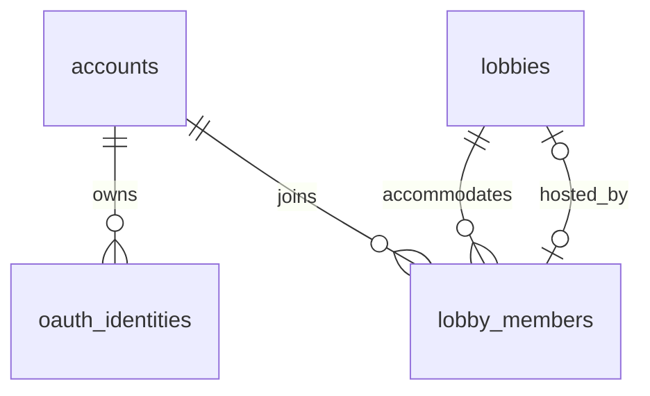

# PostgreSQL data model

Conceptual model aligned on October 2, 2026. Only the subset described in [Delivered schema](#delivered-schema) is migrated today. Source: final brief and explicit choices in [EXIGENCES.md](../EXIGENCES.md). The main diagram is in [ARCHITECTURE.md](../ARCHITECTURE.md). UUID internal identifiers, server UTC dates, versioned Drizzle migrations.

## Target tables

| Table | Key fields | Invariants |
|---|---|---|
| `accounts` | id, login?, login_canonical?, display_name, password_hash?, avatar_key?, dates | Unique local identifier, distinct from the editable nickname. OAuth account without a password allowed. No email stored, per the specification; no email-based recovery. |
| `oauth_identities` | account_id, provider, provider_subject | Unique provider + subject pair; GitHub and Discord. No automatic merging by nickname. Provider tokens are not stored if they only serve for sign-in. |
| `guest_sessions` | id, secret_digest, expires_at | Signed cookie proving a guest identity; no uploaded photo, no personal history. The nickname belongs to the presence in the room. |
| `lobbies` | id, code, visibility, capacity, host_member_id, phase, created_at, closed_at?, revision | Unique code of 6 unambiguous characters; visibility PUBLIC / CODE / PRIVATE. Capacity 2..30 participants, bots included, spectators excluded. Host is an active human of this room. |
| `lobby_settings` | lobby_id, revision, max_duration_ms?, language, text_kind, word_count, complexity, options, error_mode, bonuses_enabled, bonus_activation | One configuration per room. Timer null or 30 000..600 000 ms. Options validated by schema; version frozen at the start. Manual activation by default, automatic activation optional. |
| `lobby_members` | id, lobby_id, account_id?, guest_session_id?, bot_level?, role, display_name, display_name_canonical, joined_at, left_at? | Exactly one subject: account / guest / bot. Bot among five levels, participant role. A human is a participant or a spectator. Temporary disconnection ≠ leaving. |
| `lobby_invitations` | id, lobby_id, token_digest, bound_member_id?, bound_ip_digest?, bound_at?, revoked_at? | Random 32-byte token. The first use binds the IP and the human session; reuse by this identity/IP allowed. Revoked on kick, invalidated on closure. |
| `lobby_bans` | lobby_id, account_id? or guest_session_id?, created_at | Prevents any readmission of this identity to this room, by code, link or direct access. No global IP ban of an entire class. |
| `texts` | id, content, language, word_count, complexity, rights_reference | Real corpus in the database, verifiable provenance. Versioned/seeded dictionaries for random mode. No mandatory user text. |
| `races` | id, lobby_id, round_no, state, config_snapshot, text_snapshot, seed, rules_version, countdown_at, started_at?, ended_at?, interruption_reason? | Historical round distinct from the room; unique (lobby_id, round_no). Snapshot of the generated text even without a corpus text_id. |
| `race_entrants` | id, race_id, member_id?, account_id?, kind, name_snapshot, avatar_snapshot, target_snapshot, effective_target_chars | Identities frozen at the start, without spectators; member_id nullable after the room is purged. account_id enables the account history. Guest archived under an anonymised label without guest_session_id. |
| `race_results` | entrant_id, outcome, elapsed_ms, progress_chars, target_chars, correct_inputs, total_inputs, errors, net_mpm, gross_mpm, accuracy, rank, abandonment_reason? | One final result per entrant. Statuses FINISHED / TIMED_OUT / ABANDONED; a network timeout is a reason for abandonment, not a fourth ranking category. |
| `race_mpm_samples` | entrant_id, elapsed_ms, net_mpm, gross_mpm | Persisted time series to render the collective chart; key (entrant_id, elapsed_ms). Proposed sampling: 1 Hz + final sample. |
| `race_key_errors` | entrant_id, expected_key, error_count | Aggregates for the player's heatmap; no durable raw log of all their keystrokes. Personal access. |
| `race_bonus_events` | id, race_id, checkpoint, recipient_id, target_id?, type, granted_at, activated_at?, payload | Idempotent award per race/milestone/recipient; at most 3 bonuses per entrant. Target changes and temporary effects replayable. |

The authentication schema depends on the Auth.js prototype. With JWT sessions, an `auth_sessions` table is **not** a conceptual obligation; do not mix the two strategies. The guest cookie remains distinct and signed. No migration will be declared compliant before it has run on PostgreSQL.

## Uniqueness, identity and concurrency

- `UNIQUE(account_id) WHERE left_at IS NULL` and `UNIQUE(guest_session_id) WHERE left_at IS NULL` on members: **one active room per identity**, including as a spectator (SALLE-06). The bots' NULLs do not create collisions.
- A second tab finds the same member. A reconnection during the grace period reuses its row; after a real departure, an authorised readmission creates a new presence and therefore a new seniority.
- `UNIQUE(lobby_id, display_name_canonical) WHERE left_at IS NULL`: local disambiguation of nicknames. The account does not silently change its global nickname because of a local collision.
- Proposed canonicalisation: trim, NFKC, lowercase; accents kept. Validate length and control characters after normalisation; do not treat all visually similar scripts as equal. The guest nickname has 3..20 Unicode characters according to the documented segmentation convention.
- `UNIQUE(code)` with the alphabet `23456789ABCDEFGHJKMNPQRSTUVWXYZ`. The code is stored readable: it is not an authentication secret; protection relies on visibility, permissions and per-IP rate limiting. A PRIVATE room refuses the code.
- Capacity cannot be guaranteed by a simple cross-row CHECK: lock the room, count its active participants, then insert/change role in the same transaction.
- The host must reference a member of **the same room**, human and active. Composite constraint or transactional validation; create the room, the creator member and the host link atomically.
- Tabs are not additional participants. The uniqueness of an anonymous person who cleared their cookie or changed browser cannot be guaranteed: the scope of SALLE-06 is the proven identity.

## Invitations and IP

The invitation token is hashed in the database. The IP is normalised, then represented by an HMAC fingerprint scoped to the room; its raw value is not exposed in the invitation list. Only the headers of a known reverse proxy are trusted.

The IP alone does not prove identity: several students can share the same public IP. The link is therefore also bound to the member/session of the first use. Same IP + another cookie does not admit a second guest. An IP change is refused, in accordance with SALLE-04, even if it hinders a Wi-Fi/mobile reconnection. This constraint and the handling of a lost cookie must be explained to the user.

## Critical transactions

1. **Create / join / switch room**: identity, visibility, ban, phase and capacity checked; global uniqueness constraints. A proposed switch is confirmed before leaving the current room. The locks of two rooms are taken in a stable order.
2. **Consume an invitation**: lock invitation/room, bind IP + member only once and admit atomically; a valid repetition returns the same member.
3. **Kick / leave**: set left_at, add the ban if kicked, revoke the associated links, then select the next host or close. Broadcast after commit.
4. **Start**: authorised host, phase EN_ATTENTE, at least two participants including one present human; freeze configuration/text/entrants and start the countdown. A double click does not create two races.
5. **Finish**: idempotent finalisation of results, series, errors and bonuses; move to results in the same transaction. Repeated attempts add neither duplicate wins nor duplicate samples.

## Calculations and history

Apply Appendix A: net MPM = (correctly typed characters / 5) / minutes; gross = (typed characters / 5) / minutes; accuracy = correct / total × 100; progress = validated characters / effective target. Spaces included. Do not multiply net MPM by accuracy a second time.

The time is the server's time since the start, not only the connected time. Distinguish input counters from progress through the text. Deletion, correction, composed accents and free mode require reference tests; detailed decisions in EXIGENCES. No bonus credits keystrokes that were never made.

Ranking: FINISHED by arrival, then TIMED_OUT by progress, then ABANDONED by frozen progress. The profile and the history belong to the account; no public profile search imposed. The anonymised guest/bot snapshots do not allow viewing a personal guest history.

## Proposed retention and operations

- Guest sessions: expire after 24 h of inactivity, extended only by authenticated activity; purged after expiry and end of presence. Close/purge empty rooms, invitations/IPs and bans no later than 24 h after closure.
- Keep the anonymised snapshots useful for account results; do not keep links to the guest identity. Do not promote an old guest history when an account is created.
- For accounts, retention during the project until grading; post-grading policy to be decided before real school use. This technical choice is not a legal certification.
- Live progress in memory, no write on every keystroke. Lost connection: state kept during the grace period; result/series written at the end of the race. A process crash has no guaranteed exact recovery in this version: mark the race interrupted and do not invent its results.
- Indexes: active members, OAuth, code, public exploration (phase/visibility/dates), races per room, entrants per account/race and series per entrant/time. History pagination; grouped loading avoiding N+1.

## Data slice for checkpoint 1

Accounts, GitHub/Discord identities, guest sessions if delivered, rooms, minimal configuration and members: these elements make up the first migration. Global uniqueness, membership and capacity constraints from admission onwards, not a late fix. OAuth **is no longer postponed**.

An initial seed allows a reproducible demo with non-real local accounts. The corpus, then the demo history, are added with the game tables; TECH-04 stays partial as long as the complete seed requested does not exist. Do not create the game tables only to fill the diagram.

## Delivered schema

Migrations `0000_init` (CP-03) and `0001_session_version` (CP-04).

What actually exists in PostgreSQL today, generated by Drizzle from [`packages/database/src/schema`](../../packages/database/src/schema) and versioned in [`packages/database/drizzle`](../../packages/database/drizzle). The tables above remain the target model; nothing below claims more than these migrations.

| Table | Delivered columns | Enforced by the database |
|---|---|---|
| `accounts` | id (UUID), login?, login_canonical?, display_name, password_hash?, session_version, created_at, updated_at | **No email column.** `login` 3–32 ASCII `[A-Za-z0-9_-]` with `login_canonical = lower(login)`, both or neither; canonical login unique; a password requires a login and its hash is not empty and has the `scrypt$…` shape; display name 1–40 characters, not blank; `session_version ≥ 1`, default 1 (migration `0001`, CP-04). |
| `oauth_identities` | id, account_id → accounts (cascade), provider (`github`, `discord`), provider_subject, created_at | Unique (provider, provider_subject); one identity per provider per account. No provider tokens stored. |
| `lobbies` | id, code, visibility (`public`, `code`, `private`; default `code`), capacity, phase (`waiting`, `countdown`, `racing`, `results`, `closed` = COURSE-01 states), host_member_id?, revision, created_at, closed_at? | Unique code matching the domain alphabet `^[2-9A-HJKMNP-Z]{6}$`; capacity 2..30; `revision ≥ 0`; `closed_at` set exactly when the phase is `closed`; host is a member **of the same room** (composite foreign key `(id, host_member_id)` → `lobby_members(lobby_id, id)`, NO ACTION: a hosting member cannot be deleted, deleting the room cascades). |
| `lobby_members` | id, lobby_id → lobbies (cascade), account_id → accounts (restrict), role (`participant`, `spectator`), display_name, display_name_canonical, joined_at, left_at? | **One active room per account** (unique index on account_id where left_at is null, SALLE-06); unique canonical display name per active room; display name 1–40 characters, not blank; `left_at ≥ joined_at`; index of active members by room and seniority. |

The database's "not blank" checks only strip the space character (U+0020, `btrim`'s default): the domain rules (`parseLogin`, `parseDisplayName`) are authoritative and refuse other blank or invisible characters before any write. `updated_at` is maintained by Drizzle's `$onUpdate` (database clock, transaction start time), not by a trigger: a raw SQL update does not change it.

Guaranteed by transactions, not by keys:

- **Host still active.** The foreign key proves membership of the same room, not that the member has not left. `createRoomWithHost` creates the host as an active member in the same transaction; host succession (SALLE-08) must keep this rule.
- **Closing a room.** Moving a room to `closed` must set `left_at` for its active members in the same transaction; otherwise those accounts stay blocked by the one-active-room index (CP-06, SALLE-08).
- **Capacity.** The column bounds the setting; admitting participants up to it, under concurrency, belongs to CP-06 (lock the room, count, insert).
- **Room creation.** Room, creator membership and host link are written in one transaction. A code collision retries the whole transaction (bounded); "already in a room" is reported from the unique index, which also covers concurrent requests.

Known edge cases: an account already in a room whose generated codes all collide gets `CODE_ATTEMPTS_EXHAUSTED` rather than `ALREADY_IN_ROOM` (practically unreachable with 31⁶ codes); an account deleted while its room is being created surfaces the foreign-key error. `lobby_members.account_id` only has a partial index for active memberships; a plain index comes with account history or deletion.

Deferred to their cards, by additive migrations: account avatars (`avatar_key`, AUTH-04), guest sessions and the guest/bot subject columns of members (AUTH-02, BOT-*), room settings (CONF-*), invitations and bans (SALLE-04/07), texts, races and results.

