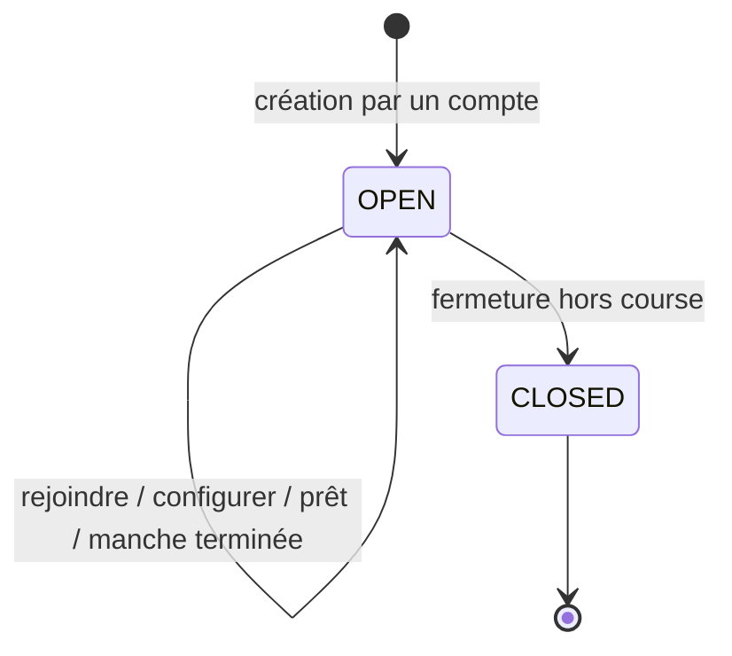
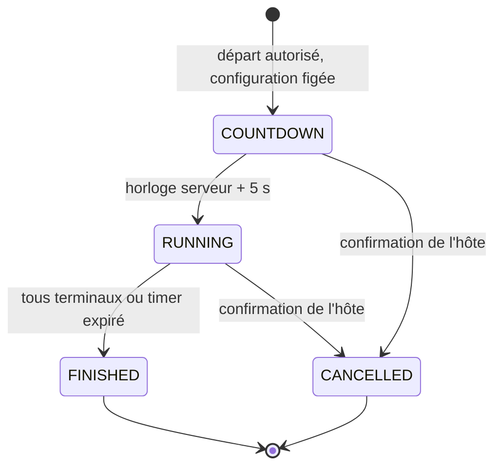
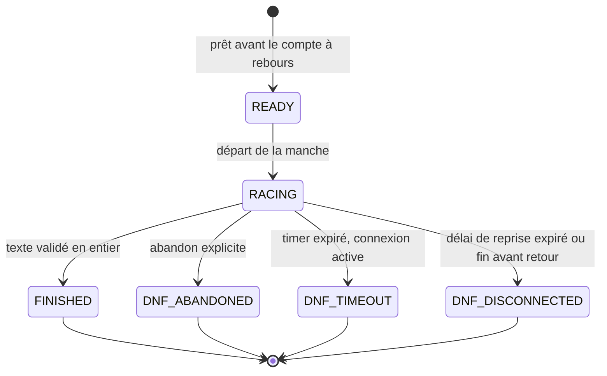

# Machines à états de la salle et de la manche

Les transitions sont exécutées par le serveur et refusées si le rôle, la révision ou l'état attendu ne correspondent pas. Les horloges client ne font pas foi. La connexion réseau et le rôle d'hôte sont **orthogonaux** au résultat d'un coureur.

## 1. Salle persistante

Une salle n'est pas une manche. Elle survit à plusieurs courses; ses membres redeviennent non prêts après chaque résultat.

Le statut `COUNTDOWN` ou `RUNNING` appartient à la **manche active**. Pendant ces états, la salle reste ouverte à l'observation, mais la configuration est verrouillée. Un invité ne crée pas la salle. Le matchmaking peut, par décision technique à confirmer, demander au système de créer une salle **gérée par le système**, sans conférer le rôle d'hôte à l'invité. Cette salle a une configuration prédéfinie et un départ automatique quand les gardes sont satisfaites.

## 2. Manche

| Transition | Garde | Effet durable |
|---|---|---|
| `OPEN → COUNTDOWN` | Salle ouverte, aucune manche active, ≥ 2 coureurs **prêts et connectés**; un bot peut être le deuxième. Pour une salle manuelle, demande de l'hôte authentifié; pour une salle système, déclenchement automatique. | Créer la manche et les entrants, figer texte, mode, erreurs, bonus et durée; fixer `countdown_at`; empêcher les changements pour cette manche. |
| `COUNTDOWN → RUNNING` | Les cinq secondes sont écoulées selon le serveur. | Fixer `started_at`; annoncer le même instant de départ à tous. Les non-prêts et nouveaux arrivants restent spectateurs. |
| `RUNNING → FINISHED` | Tous les entrants ont un état terminal **ou** le timer serveur expire. | Finaliser les DNF restants, écrire les résultats une seule fois, calculer le classement, remettre les membres non prêts pour la manche suivante. |
| `COUNTDOWN/RUNNING → CANCELLED` | Confirmation explicite de l'hôte actuel pour une salle manuelle; règle de secours du système à définir pour une salle automatique. | Diffuser l'annulation, ne publier aucun résultat officiel; la salle peut être reconfigurée et relancée. |
| `OPEN → CLOSED` | Hôte ferme la salle hors course, ou plus aucun compte éligible ne peut l'héberger. | Bloquer les nouvelles admissions; conserver l'historique des manches déjà finies. |

Une annulation n'est pas un abandon. Un hôte qui veut changer la configuration confirme l'annulation de la manche active; un hôte qui veut simplement partir transfère son rôle et la manche continue.

## 3. Coursier et connexion

La connexion suit séparément `CONNECTED → DISCONNECTED_GRACE → CONNECTED` si reprise autorisée, ou `DISCONNECTED_GRACE → EXPIRED` après cinq minutes. Une déconnexion **n'efface pas** l'avancement validé. La manche continue pour les autres. Le coureur reprend sa place seulement si sa session et sa manche sont toujours valides, que le délai n'est pas expiré et que la manche est encore `RUNNING`. Si elle se termine avant son retour, son résultat est `DNF_DISCONNECTED` avec sa dernière progression; s'il était encore connecté au timer, c'est `DNF_TIMEOUT`. Un abandon explicite est irréversible pour cette manche.

Le serveur ignore les messages de frappe reçus pour un spectateur, un entrant terminal, une ancienne manche, ou un numéro de séquence déjà traité. Il valide le texte attendu et met à jour les compteurs de frappe. Les corrections en modes libre/bloqué auront des tests de référence avant de calculer le score officiel.

## 4. Rôle de l'hôte

- **Coupure courte** : garder le rôle à l'hôte pendant la période de reprise (cinq minutes pendant la course); sa reconnexion restaure son accès. Si la course finit plus tôt, la politique de salle peut encore permettre son retour tant que la salle reste ouverte; ce délai hors course reste un choix technique à expliciter.
- **Départ volontaire** : le compte désigné par l'hôte prend le rôle s'il est toujours présent et éligible; sinon, le compte présent le plus ancien le prend. Ni invité ni bot n'est éligible.
- **Expiration de la coupure** : même sélection qu'au départ volontaire. Sans successeur pendant une manche manuelle, le système la laisse finir puis ferme la salle; hors course, il ferme la salle. Ce relais temporaire est distinct d'une salle matchmaking gérée durablement par le système.
- **Annulation** : seule une demande confirmée de l'hôte actif annule la manche. Quitter sans demander l'annulation ne l'annule pas.

La sélection du successeur et l'écriture du nouvel hôte doivent être atomiques afin de gérer deux départs rapprochés.

## 5. Classement et cas de test

Les finisseurs passent avant les non-finisseurs. Pour les finisseurs : WPM net décroissant. En `STANDARD`, les DNF sont classés par progression décroissante, puis précision et WPM net. À égalité résiduelle, l'instant du dernier progrès et l'identifiant stable donnent un ordre déterministe. Ces départages secondaires sont une **règle de conception**, à vérifier avec le client si elle influence une évaluation scolaire. En Arcade, si les bonus modifient la longueur individuelle du texte, le départage DNF doit encore être confirmé; ne pas comparer naïvement deux nombres de caractères. Les records et tableaux Arcade/Standard, puis modes d'erreur, sont isolés.

Cas à tester impérativement : deuxième participant bot; hôte spectateur; arrivée pendant compte à rebours; double clic « démarrer »; annulation pendant et après compte à rebours; hôte volontairement parti contre simple coupure; retour à 4 min 59 s contre 5 min 01 s; timer pendant l'absence; deux invitations utilisées en concurrence; 50 humains connectés durant dix minutes.
