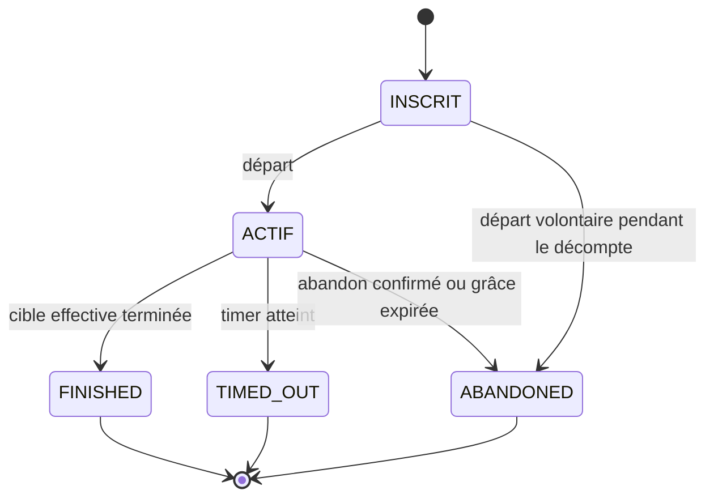

# États, présence et classement

Alignement du 2 octobre 2026. L'[énoncé final](../Web-V-Travail-de-session.pdf) remplace les anciens délais et classements. Le serveur valide rôle, identité, phase et révision avant chaque transition.

## 1. Salle et manche

La salle persiste entre les courses. Sa phase suit exactement la séquence métier COURSE-01, représentée dans [ARCHITECTURE.md](../ARCHITECTURE.md). La configuration mutable de salle devient un snapshot de manche au lancement.

| Transition | Garde et effet |
|---|---|
| Création → EN_ATTENTE | Compte authentifié uniquement; il devient hôte participant ou spectateur. Code de 6 caractères. |
| EN_ATTENTE → DECOMPTE | Hôte, 2..capacité participants dont au moins un humain présent; bots inclus, spectateurs exclus. Figer texte/configuration/entrants; révéler le texte maintenant, jamais avant. |
| DECOMPTE → EN_COURSE | Horloge serveur après **3 secondes**, départ commun. Aucune frappe anticipée acceptée. |
| EN_COURSE → RESULTATS | Tous FINISHED/ABANDONED, ou timer expiré; attribuer TIMED_OUT aux entrants encore actifs, puis persister une fois. |
| RESULTATS → EN_ATTENTE | Hôte prépare une nouvelle manche avec les membres restants; configuration de nouveau modifiable. |
| EN_ATTENTE/RESULTATS → FERMEE | Fermeture par l'hôte; invalider liens et admissions, libérer les présences. |
| Toute phase ouverte → FERMEE | Après départ/expiration de l'hôte, aucun successeur humain connecté : fermer selon SALLE-08. Si course active, conserver une trace d'interruption, sans faux résultat achevé. |

Choix de portée : pas de bouton « annuler la course en cours pour changer les réglages » avant les obligations finales. L'hôte peut partir et transmettre son rôle; les réglages se changent entre les manches. Pas d'hôte système ni de départ automatique de matchmaking. Un contrôle « prêt » n'est pas requis par COURSE-02 et n'est pas ajouté comme condition obligatoire.

## 2. Admission et présence

| État de salle | Nouvelle personne | Même membre qui se reconnecte |
|---|---|---|
| EN_ATTENTE / RESULTATS | Oui, selon visibilité, capacité, bannissement et unicité. | Snapshot de la salle; même membre dans la période de grâce. |
| DECOMPTE / EN_COURSE | Non, **même pour un nouveau spectateur**. | Oui pendant 30 secondes, pour la place déjà détenue; sinon plus de reprise de cette manche. |
| FERMEE | Non. | Historique accessible au compte selon ses droits, mais pas de réadmission. |

PUBLIC : accès direct/code, explorateur et quickplay. CODE : code/lien sans référencement. PRIVATE : lien seulement, jamais code. Les trois politiques ne sont pas deux variantes d'une « salle privée ».

Une personne est représentée par une identité de compte ou un cookie invité signé. Plusieurs sockets/onglets se rattachent au même membre. Seule la fermeture de la dernière connexion commence la grâce. Pour la saisie, une seule connexion détient le contrôle d'un entrant à la fois; le second onglet observe ou demande le transfert explicite du contrôle.

## 3. Coureur et déconnexion

Connexion orthogonale : CONNECTED → GRACE → CONNECTED, ou GRACE → EXPIRED. Le temps de grâce est **30 000 ms**, en attente aussi par choix de conception. Retour accepté jusqu'à l'échéance incluse si la phase le permet; événement reçu après l'échéance refusé. Le serveur compare l'horloge à l'échéance, même si son traitement du timer est retardé.

- La course continue pendant la coupure; la progression acceptée est conservée.
- Expiration de grâce : ABANDONED, motif DISCONNECTION_TIMEOUT, progression figée à la dernière saisie acceptée.
- Timer de course expirant **avant** la grâce : TIMED_OUT, même si l'entrant est momentanément absent. Une déconnexion ne devient pas un abandon avant les 30 secondes.
- Pour deux échéances identiques, traiter d'abord la fin du temps de course : choix déterministe documenté.
- Départ volontaire de salle en course ou abandon confirmé : ABANDONED immédiatement, sans reprendre cette manche.
- Un résultat terminal est immuable. Les paquets retardés/rejoués n'améliorent jamais le rang ni le résultat.
- Coupure pendant le décompte : l'entrant reste inscrit, la grâce commence, la course démarre à l'heure prévue. Une reprise valide rejoint le temps courant, pas un nouveau départ.

## 4. Hôte

Départ volontaire : transférer au plus ancien humain **encore connecté au réseau**, participant ou spectateur; égalité départagée par identifiant stable. Un bot n'est jamais éligible. Si aucun humain ne reste, fermer la salle.

Interprétation de SALLE-08 : un invité déjà présent peut hériter du rôle, puisqu'il est humain; AUTH-03 interdit de **créer**, pas explicitement d'hériter. Cette interprétation est consignée dans EXIGENCES et peut être ajustée si le prof précise « compte authentifié ». Ne pas y ajouter un successeur préféré qui contourne l'ancienneté imposée.

Coupure courte : conserver le rôle pendant les 30 secondes; les actions d'hôte restent indisponibles durant cette absence. Expiration : même traitement qu'un départ. La sélection et l'écriture du nouvel hôte sont atomiques. La fermeture d'un onglet ne provoque pas de succession si une autre connexion du même membre est active.

## 5. Classement et bonus

1. FINISHED : temps serveur d'arrivée croissant.
2. TIMED_OUT : fraction de progression décroissante.
3. ABANDONED : fraction de progression figée au moment de l'abandon, décroissante.

Égalités exactes : précision décroissante puis identifiant stable; ces critères ne peuvent jamais faire passer un abandonnant devant un finisseur. Le MPM reste une statistique, pas le premier critère des finisseurs.

Progression = avancement validé / longueur effective individuelle. Les bonus modifient uniquement le texte restant; ni retrait de frappes déjà validées ni crédit artificiel de MPM. Un seuil de bonus déjà franchi ne se redéclenche pas si le meneur change ou si sa progression recule après ajout de mots. Règles initiales des bonus dans EXIGENCES.

## 6. Tests de frontières prévus

- 1 humain + 1 bot accepté; 2 bots refusés; hôte spectateur non compté.
- Capacité 30, 31e refusé; spectateur non compté; admissions concurrentes sans dépassement.
- Code privé refusé; invitation réutilisée par même identité/IP, refusée par autre IP ou autre identité derrière le même NAT.
- Admission pendant décompte/course refusée; reprise d'un membre existant autorisée dans la grâce.
- Retour à 29 999 / 30 000 / 30 001 ms; timer de course avant/après grâce; deux onglets.
- Succession à un spectateur ou invité ancien; aucun humain restant; expulsions et liens révoqués.
- Départ reçu deux fois, finalisation reçue deux fois, message d'une ancienne course, bonus reçu deux fois.
- Finisseur plus lent en MPM mais arrivé avant un autre : son temps d'arrivée reste prioritaire.
- Mode libre, correction obligatoire, Unicode, zéro frappe, bonus modifiant la cible et MPM cohérents.

Au checkpoint, automatiser prioritairement identité/permissions, code, admission, unicité multi-onglet et présence. Les tests de course deviennent obligatoires avec l'implémentation correspondante.
