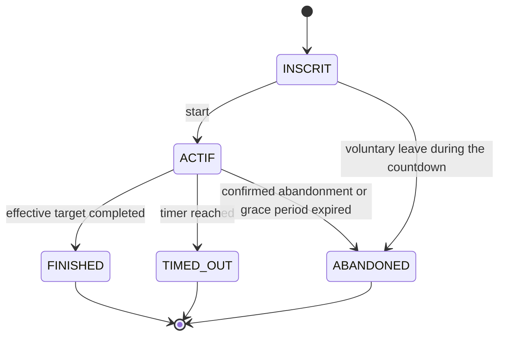

# States, presence and ranking

Alignment of October 2, 2026. The [final brief](../Web-V-Travail-de-session.pdf) replaces the former delays and rankings. The server validates role, identity, phase and revision before each transition.

## 1. Room and round

The room persists between races. Its phase follows exactly the COURSE-01 business sequence, shown in [ARCHITECTURE.md](../ARCHITECTURE.md), with the official state names EN_ATTENTE (waiting), DECOMPTE (countdown), EN_COURSE (racing), RESULTATS (results) and FERMEE (closed). The room's mutable configuration becomes a round snapshot at start.

| Transition | Guard and effect |
|---|---|
| Creation → EN_ATTENTE | Authenticated account only; it becomes the host, as participant or spectator. 6-character code. |
| EN_ATTENTE → DECOMPTE | Host, 2..capacity participants including at least one present human; bots included, spectators excluded. Freeze text/configuration/entrants; reveal the text now, never before. |
| DECOMPTE → EN_COURSE | Server clock after **3 seconds**, common start. No early keystroke accepted. |
| EN_COURSE → RESULTATS | All FINISHED/ABANDONED, or timer expired; assign TIMED_OUT to the entrants still active, then persist once. |
| RESULTATS → EN_ATTENTE | The host prepares a new round with the remaining members; configuration editable again. |
| EN_ATTENTE/RESULTATS → FERMEE | Closure by the host; invalidate links and admissions, release the presences. |
| Any open phase → FERMEE | After the host's departure/expiry, no connected human successor: close according to SALLE-08. If a race is active, keep a trace of the interruption, without a fake completed result. |

Scope choice: no "cancel the current race to change the settings" button before the final obligations. The host can leave and hand over their role; settings are changed between rounds. No system host and no automatic matchmaking start. A "ready" check is not required by COURSE-02 and is not added as a mandatory condition.

## 2. Admission and presence

| Room state | New person | Same member reconnecting |
|---|---|---|
| EN_ATTENTE / RESULTATS | Yes, depending on visibility, capacity, ban and uniqueness. | Room snapshot; same member within the grace period. |
| DECOMPTE / EN_COURSE | No, **not even as a new spectator**. | Yes for 30 seconds, for the spot already held; after that, no more resumption of this round. |
| FERMEE | No. | History accessible to the account according to its rights, but no readmission. |

PUBLIC: direct access/code, explorer and quickplay. CODE: code/link without listing. PRIVATE: link only, never code. The three policies are not two variants of a "private room".

A person is represented by an account identity or a signed guest cookie. Several sockets/tabs attach to the same member. Only closing the last connection starts the grace period. For input, only one connection controls an entrant at a time; the second tab observes or requests an explicit transfer of control.

## 3. Runner and disconnection

In this diagram, INSCRIT means registered and ACTIF means active. Orthogonal connection state: CONNECTED → GRACE → CONNECTED, or GRACE → EXPIRED. The grace period is **30 000 ms**, also while waiting, as a design choice. A return is accepted up to and including the deadline if the phase allows it; an event received after the deadline is refused. The server compares the clock with the deadline, even if its processing of the timer is delayed.

- The race continues during the disconnection; accepted progress is kept.
- Grace period expiry: ABANDONED, reason DISCONNECTION_TIMEOUT, progress frozen at the last accepted input.
- Race timer expiring **before** the grace period: TIMED_OUT, even if the entrant is momentarily absent. A disconnection does not become an abandonment before the 30 seconds.
- For two identical deadlines, process the end of the race time first: documented deterministic choice.
- Voluntary departure from the room during a race, or confirmed abandonment: ABANDONED immediately, without resuming this round.
- A terminal result is immutable. Delayed/replayed packets never improve the rank or the result.
- Disconnection during the countdown: the entrant stays registered, the grace period starts, the race starts at the scheduled time. A valid resumption joins at the current time, not at a new start.

## 4. Host

Voluntary departure: transfer to the most senior human **still connected to the network**, participant or spectator; ties broken by stable identifier. A bot is never eligible. If no human remains, close the room.

Interpretation of SALLE-08: a guest already present can inherit the role, since they are human; AUTH-03 forbids **creating**, not explicitly inheriting. This interpretation is recorded in EXIGENCES and may be adjusted if the teacher specifies "authenticated account". Do not add a preferred successor that bypasses the imposed seniority.

Short disconnection: keep the role for the 30 seconds; host actions stay unavailable during this absence. Expiry: same handling as a departure. Selecting and writing the new host are atomic. Closing a tab does not trigger a succession if another connection of the same member is active.

## 5. Ranking and bonuses

1. FINISHED: increasing server arrival time.
2. TIMED_OUT: decreasing progress fraction.
3. ABANDONED: progress fraction frozen at the time of abandonment, decreasing.

Exact ties: decreasing accuracy, then stable identifier; these criteria can never place an abandoning entrant ahead of a finisher. MPM remains a statistic, not the first criterion for finishers.

Progress = validated advancement / individual effective length. Bonuses only change the remaining text; no removal of already validated keystrokes and no artificial MPM credit. A bonus threshold already crossed does not trigger again if the leader changes or if their progress goes back after words are added. Initial bonus rules in EXIGENCES.

## 6. Planned boundary tests

- 1 human + 1 bot accepted; 2 bots refused; spectator host not counted.
- Capacity 30, 31st refused; spectator not counted; concurrent admissions without exceeding capacity.
- Private code refused; invitation reused by the same identity/IP, refused from another IP or for another identity behind the same NAT.
- Admission during countdown/race refused; resumption by an existing member allowed within the grace period.
- Return at 29 999 / 30 000 / 30 001 ms; race timer before/after the grace period; two tabs.
- Succession to a senior spectator or guest; no human remaining; kicks and revoked links.
- Start received twice, finalisation received twice, message from an old race, bonus received twice.
- Finisher slower in MPM but arrived before another: their arrival time keeps priority.
- Free mode, mandatory correction, Unicode, zero keystrokes, bonus changing the target and consistent MPM.

At the checkpoint, automate first identity/permissions, code, admission, multi-tab uniqueness and presence. Race tests become mandatory with the corresponding implementation.
